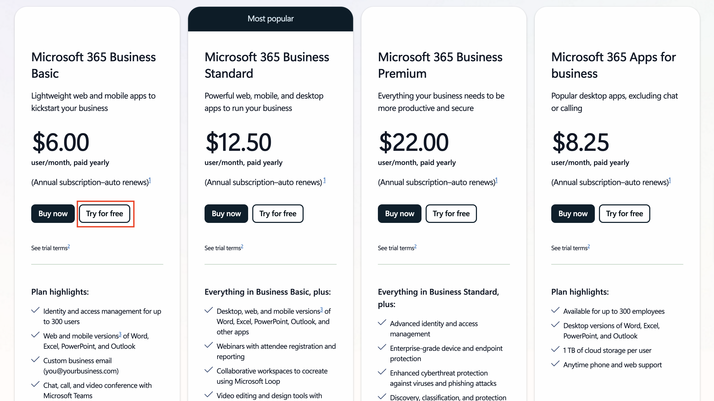
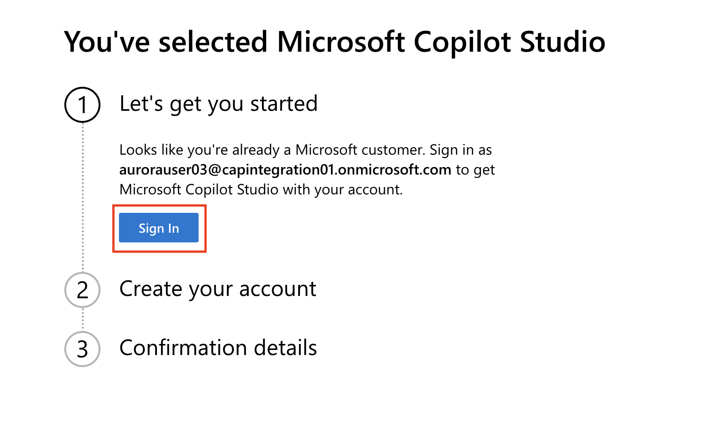
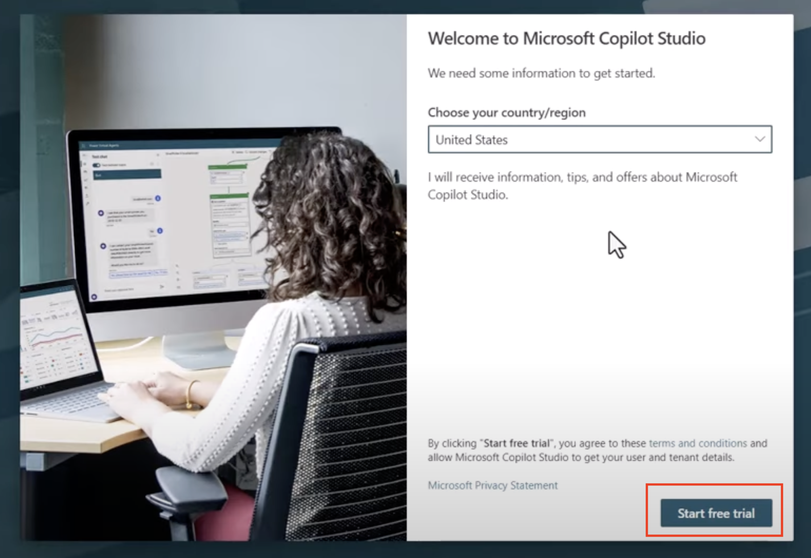
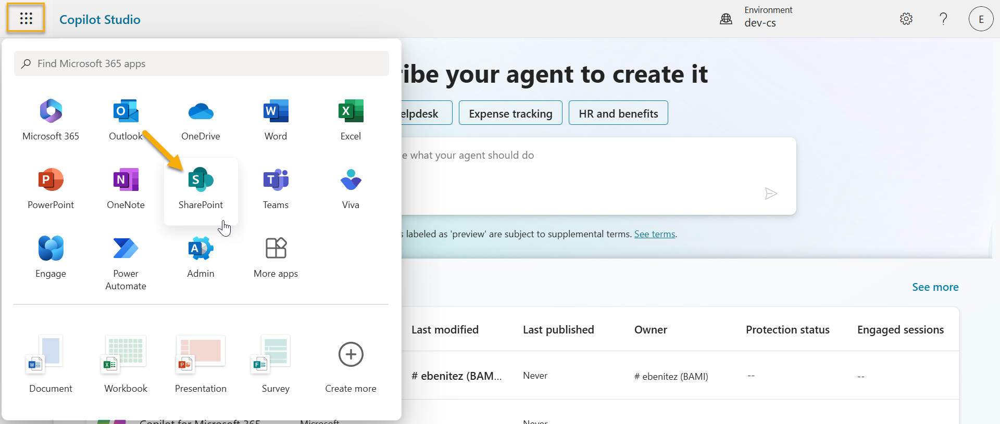
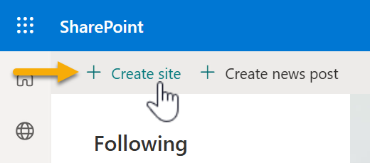
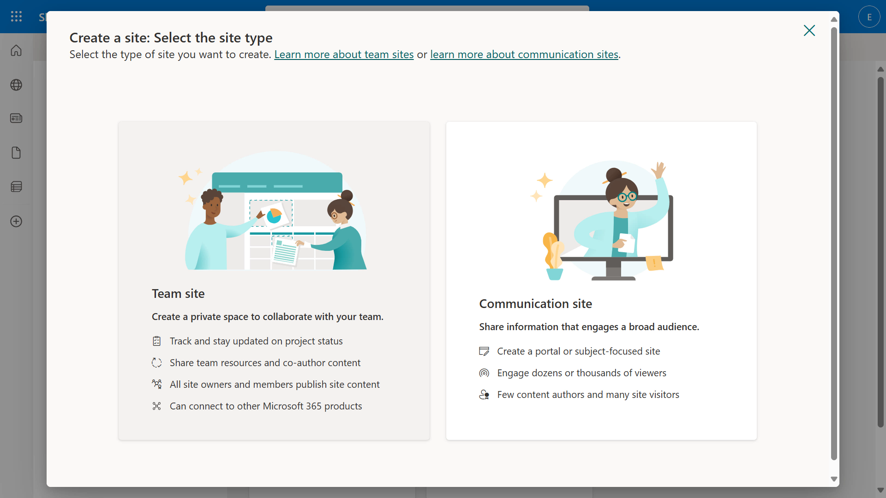
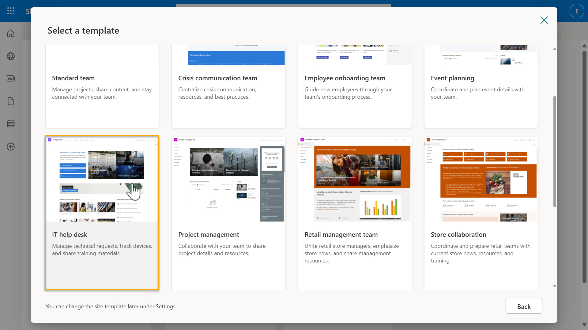
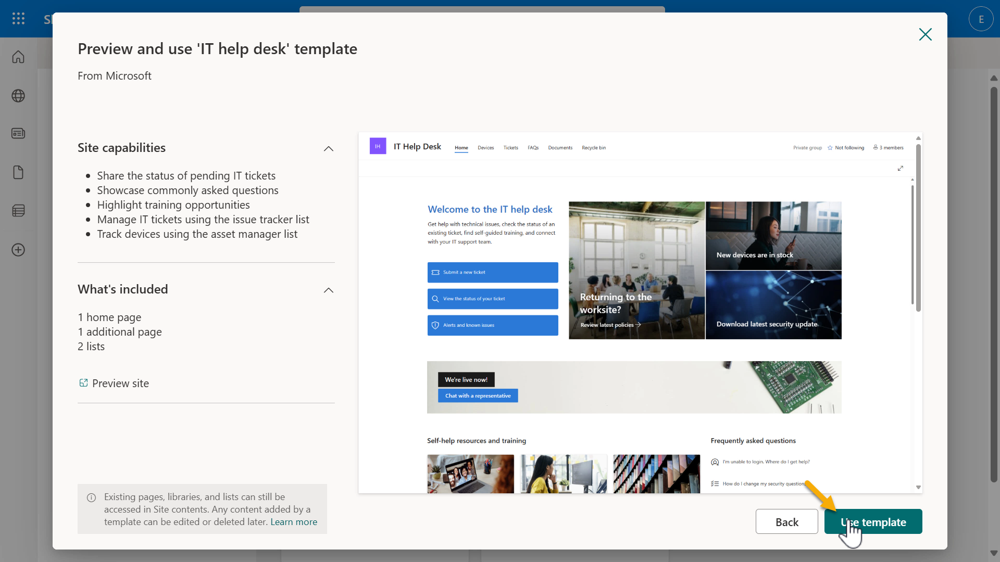
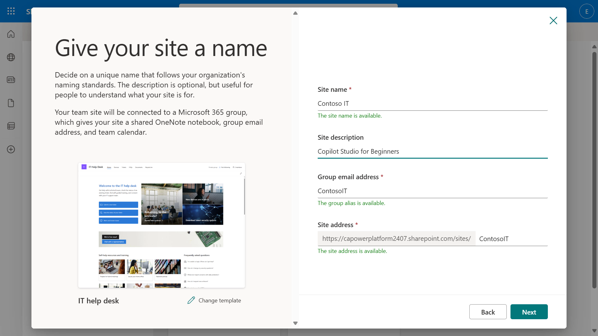
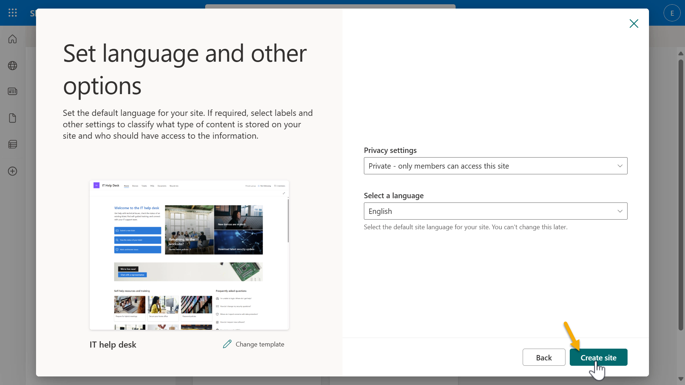

# Course Setup

We are very excited for you to start this course and learn how to build your first agent with Copilot Studio!

To help you get started, this page outlines the technical requirements and steps needed to get an environment up and running so you can start building. 

Copilot Studio is part of the Microsoft 365 ecosystem, so you’ll need a Microsoft 365 account (work or school) to get started. These instructions cover:

1. Signing up for a Microsoft 365 account.  
1. Configuring your Microsoft 365 tenant for Copilot Studio  
1. (Optional) Obtaining a Microsoft 365 Copilot license (required to publish agents into Copilot chat)  
1. Accessing Copilot Studio and verifying your environment

---

## Prerequisites

Before you begin, ensure you have:

1. A **work or school email address** (personal @outlook.com, @gmail.com, etc., are not supported).   
1. Access to the internet and a modern browser (Edge, Chrome, or Firefox recommended).  
1. Basic familiarity with Microsoft 365 (for example, signing into Office apps or Teams).  
1. (Optional) A credit card or billing method if you plan to purchase paid licenses.

---

## Step 1: Get a Microsoft 365 Account

Copilot Studio resides within Microsoft 365, so you need a Microsoft 365 account to access it. You can either use an existing account if you have one or follow these steps to get an appropriate license:

1. **Acquire a Paid Microsoft 365 Business Subscription**  
   1. Go to the [Microsoft 365 Business Plans and Pricing Page](https://www.microsoft.com/en-us/microsoft-365/business/microsoft-365-plans-and-pricing) 
   1. The cheapest option to get you started is the Microsoft 365 Business Basic plan. Select `Try for free` and walk through the guided form to fill in your subscription and account details and payment information.
   
   1. Once you have your new account, login. 

> **Tip:** If you plan to publish agents into Microsoft 365 Copilot Chat or connect to organizational data (SharePoint, OneDrive, Dataverse), a Microsoft 365 Copilot license is required. This is an add-on license which you can learn more about [here](https://www.microsoft.com/en-us/microsoft-365/copilot#plans)

---

## Step 2: Start a Copilot Studio Trial

Once you have your M365 Tenant, you need to get access to Copilot Studio. You can get a free 30 day trial by following these steps:

1. Navigate to [aka.ms/TryCopilotStudio](https://aka.ms/TryCopilotStudio).  
1. Enter the email address from the new account you configured in the previous step and select `Next`.  

1. It should recognize your account. Select `Sign In`.
  
1. Select `Start Free Trial`. 
 

> **Trial Notes:**  
> 1. The free trial provides **full Copilot Studio capabilities**.  
> 1. You will receive email notifications about your trial expiration. You can extend the trial in 30-day increments (up to 90 days of agent runtime).  
> 1. If your tenant administrator disabled self-service sign-up, you’ll see an error—contact your Microsoft 365 admin to re-enable it.  
---

## Step 3: Create new SharePoint site

A new SharePoint site needs to be created  which will be used in [Lesson 06 - Create a custom agent using the conversational creation experience with Copilot and grounding it with your data](https://github.com/microsoft/copilot-studio-for-beginners/blob/main/06-create-agent-from-conversation/README.md#62-add-an-internal-knolwedge-source-using-a-sharepoint-site---for-microsoft-365-licensed-users-with-sharepoint).

1. Select the waffle icon on the top left hand side of Microsoft Copilot Studio to view the menu. Select SharePoint from the menu.

   

1. SharePoint will load. Select **+ Create  site** to create a new SharePoint site.

   

1. A dialog will appear to guide you in creating a new SharePoint site. Select **Team site** or **Communication site**.

   

1. In the next step, a list of Microsoft templates will load by default. Scroll down and select the **IT help desk** template.

   

1. Select **Use template** to create a new SharePoint site using the IT help desk template.

   

1. Enter information for your site. The following is an example:

    | Field | Value |
    | --- | --- |
    | Site name | Contoso IT |
    | Site description | Copilot Studio for Beginners |
    | Site address | ContosoIT |

   

1. In the final step, a language can be selected for the SharePoint site. By default it will be **English**. Leave the Language as **English** and select **Create site**,

   

1. The SharePoint site will provision for the next few seconds. In the mean time, you can choose to add other users to your side by entering their email address in the **Add members** field. When completed, select **Finish**.

   

1. The SharePoint site home page will next load. **Copy** the SharePoint site URL.

1. This template provides pages with sample data about various IT policies and two sample lists (Tickets and Devices). 

   We will use the **Devices** list for in [Lesson 07 - Add new topic with trigger and nodes](/07-add-new-topic-with-trigger/README.md/#73-add-node---add-a-tool-using-a-connector). 

   You need to make sure you fill in this list with at least 4 sample data items and add one additional column to this list.
   
   Scroll to the far right in the list and select the **+ Add column** button.  Choose the **hyperlink** type, enter **Image** for the column name, and select add.  

   When adding sample data, make sure that the following fields are filled out: 
      - Device photo - use the images from the [device images folder](/00-course-setup/images/device-images/)
      - Title
      - Status
      - Manufacturer
      - Model
      - Asset Type
      - Color
      - Serial Number
      - Purchase Date
      - Purchase Price, 
      - Order # 
      - Image

---

Congratulations—you now have a working Microsoft 365 developer environment with Copilot Studio access. You’re ready to start building, testing, and publishing AI agents for Microsoft 365!  
