# Add new topic with trigger and nodes

## Lesson chapters

- [What is a Topic?](#-what-is-a-topic)
    - [Purpose of a topic](#-purpose-of-a-topic)
- [Why are topics useful?](#-why-are-topics-useful)
- [Types of topics](#-anatomy-of-a-topic)
    - [Triger phrases](#️triger-phrases)
    - [Conversation nodes](#-conversation-nodes)
- [Using Power Fx in your nodes](#️-using-power-fx-in-your-nodes)
    - [What Power Fx can do in topics](#what-power-fx-can-do-in-topics)
    - [Why use Power Fx?](#why-use-power-fx)
- [How do I create and edit topics?](#️-how-do-i-create-and-edit-topics)
    - [Create from blank](#1-create-from-blank)
    - [Create with Copilot](#2-create-with-copilot)
- [OK, how do I design topics for my agent?](#-ok-how-do-i-design-topics-for-my-agent)
- [Lab 07 - Add a new topic with conversation nodes](#-lab-07---add-a-new-topic-with-conversation-nodes)
    - [Use case](#-use-case)
    - [Prerequisites](#prerequisites)
    - [7.1 Add a new topic from blank](#71-add-a-new-topic-from-blank)
    - [7.2 Add node - Ask a Question and create a custom entity](#72-add-node---ask-a-question-and-create-a-custom-entity)
    - [7.3 Add node - Add a tool using the SharePoint connector](#73-add-node---add-a-tool-using-a-connector)
- [Additional learning](#-additional-learning)

## 🤔 What is a Topic?

A topic is a structured conversation that helps your agent respond to specific user questions or tasks. Think of a topic as a mini-conversation or task that your agent can handle. Each topic is designed to respond to a specific user question or request.

### 🌌 Purpose of a topic
There are three common purposes for topics based on what users need:

**Informational** - answers questions such as the following:
- <samp>"What is …?"</samp>
- <samp>"When will …?"</samp>
- <samp>"Why …?"</samp>
- <samp>"Can you tell me …?"</samp>

**Task completion** - helps users _do_ something:
- <samp>"I want to …"</samp>
- <samp>"How do I …?"</samp>
- <samp>"I need …?"</samp>

**Troubleshooting** - solves problems:
- <samp>"Something isn’t working …"</samp>
- <samp>"I'm encountering an error message …"</samp>
- <samp>"I’m seeing something unexpected …?"</samp>


You can also create topics for ambiguous questions like "<samp>I need help</samp>," which ask users for more details before continuing.

## 🐦 Why are topics useful?
Topics help you,

- Organize your agent's knowledge.

- Make conversations feel natural.

- Solve user problems effeciently.

## 🪺 Types of topics

1. **System topics** - these are built-in and handle common events such as:
    - Starting a conversation
    - Ending a conversation
    - Handling errors
    - Asking users to sign in
    - Escalating to a human agent

1. **Custom topics** - you create these to handle specific tasks or questions such as:
    - Employee leave request
    - Request new or replacement device


##  🧬 Anatomy of a topic

Each topic usually contains the following.

### 🗣️Triger phrases

These are words or sentences users might say to start the topic.

**Examples:**

For a leave request topic, trigger phrases could be

- <samp>"I want to take vacation leave"</samp>
- <samp>"Request vacation"</samp>
- <samp>"Apply for time off"</samp>
- <samp>"How do I submit a leave request?"</samp>

For a request device topic, trigger phrases could be
- <samp>"I need a new device"</samp>
- <samp>"Can I request a device?"</samp>
- <samp>"Can you help me with a device request"</samp>

### 💬 Conversation nodes

A topic is made up of nodes which are steps the agent follows once the topic is triggered. You connect these steps to build a conversation flow that your agent follows when interacting with users.

Think of these as instructions or actions such as the following:

- Asking the user questions
- Sending messages
- Calling an external service such as leave management system
- Setting or checking variables
- Using conditions to branch the conversation
- Directing to another topic

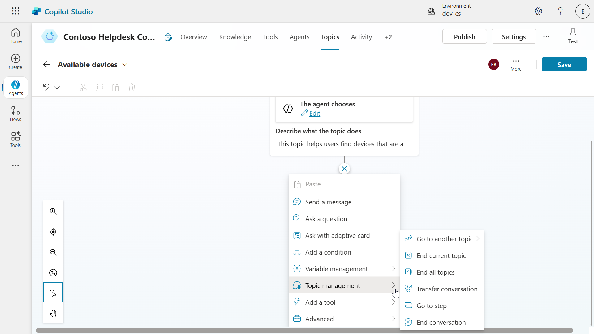

The following are the main types of nodes you can add to an agent:

1. **Send a message**
    - **Purpose** - sends a mesage to the user.
    - **Example** - <samp>"Thanks for your request! I'll help you with that."</samp>

    This node lets your agent send messages to users, which can be simple text or rich content like images, videos, cards, quick replies and adaptive cards. 
    
    You can personalize messages using variables, add multiple message variations for variety, and even customize speech output for voice-enabled channels.

    > Think of it as a "say something" block that helps your agent communicate clearly and interactively with users.

1. **Ask a question**
    - **Purpose** - asks the user a question and waits for their answer.
    - **Example** - <samp>"What are your vacation dates?"</samp>

    This node is used to ask users for specific information during a conversation and store their responses in variables for later use. 

    You can customize the type of question like text input or use entities for a defined list of values a user selects from, and define how the agent should behave if the user gives an invalid answer or skips the question. 

    It also supports rich content like images and quick replies, and lets you fine-tune validation, reprompting, and interruption settings to make the conversation flow smoothly.

    > Think of it as an "ask and listen" block that helps your agent interact with users in a structured way that you define.

1. **Ask with adaptive card**
    - **Purpose** - send a rich, interactive card using JSON.
    - **Example** - a card that displays a calendar date picker for a user to select a date.

    This node shows rich, interactive cards that users can fill out and submit such as forms with text boxes, buttons, and images. It captures the user's input and stores it in variables, which your agent can use later in the conversation.

    > Think of it as a customizable "form builder" block that makes your agent more engaging and capable of collecting detailed information from users.

1. **Add a condition**
    - **Purpose** - add logic to the conversation. It checks something and decides what to do next.
    - **Example** - if the user says "<samp>Yes</samp>," go to the next step. If "<samp>No</samp>," end the conversation.

    This node creates decision points in your agent's conversation flow by checking if a variable meets certain criteria. Based on whether the condition is true or false, the agent follows different paths.

    > Think of it as an "if-else" block that helps your agent make descisions depending on user input or stored data in variables.

1. **Variable management**
    - **Purpose** - stores or clears information (called variables) during the conversation.
    - **Example** - saves the date the user selected in the Ask a question node that displays an adaptive card.

    This node lets you store and manage information during a conversation, it could be a user's name, answer, or preferences. You can use different types of variables such as text, numbers, or dates, and they can be scoped to a single topic, shared across topics (global), or even pulled from the system or environment.

    > Think of it as a "memory box" that helps your agent remember information and use them as the conversation continues with the user.

1. **Topic management**
    - **Purpose** - moves the conversation to another topic or step within the topic, transfer the conversation, or end the topic or conversation.
    - **Example** - redirect to a "Leave Policy" topic.

    This node allows your agent to jump from one topic to another without restarting the conversation, end the topic, transfer or end the conversation, or go to a different step within the same topic. It helps guide users through different parts of the conversation flow by smoothly transitioning between topics, and you can pass variables between them to keep context.

    > Think of it as a "go to another section/step" block that helps your agent be flexible in chatting with users.

1. **Add a tool**
    - **Purpose** - connects to external tools such as Power Automate, Excel, ServiceNow.
    - **Example** - Power Automate cloud flow executed after user submits their vacation leave request.

    This node gives your agent capabilities to interact with external systems or perform specific tasks, such as sending emails, checking weather, or accessing databases. You can add tools using built-in connectors, custom APIs, agent flows, prompts, or connect to Model Context Protocol (MCP) servers, and even _graphical user interface_ automation for desktop apps through the computer use tool.

    > Think of tools as "action blocks" that give your agent superpowers to do things beyond _chatting_, such as calling an API, running a process, or collecting user input automatically.

1. **Generative answers node**
    - **Purpose** - uses a large language model to generate natural, human-like responses based on the user's question and any connected data.
    - **Example** - uses the connected knowledge source that contains information on vacation leave entitlements to answer user questions regarding vacation requests.

    This node enables your agent to respond to user questions using information from various knowledge sources, like websites, documents, SharePoint, or custom data. It can be used as a fallback when no matching topic is found, or within a topic to provide more detailed, dynamic answers based on specific sources you've configured your agent to use.

    > Think of it as a "smart answer block" that helps your agent give helpful, accurate responses by searching trusted content you define.

1. **HTTP request node**
    - **Purpose** - connect your agent to external systems by sending API calls (for example `GET` or `POST`) to fetch or update data.
    - **Example** - when a user asks for their vacaction days balance, the agent performs a `GET` request to the leave management system and extracts the `remainingLeaveDays` from the API response and replies to the user with the value.

    This node lets your agent connect to external systems by sending REST API calls, like `GET` or `POST` requests. You can customize the request with headers, body content, and even use Power Fx to include dynamic data, then store the response in variables for use later in the conversation.

    > Think of it as a "reach out and get information" block that helps your agent talk to other services such as retrieving user details or sending data to another system.

1. **Send an event**
    - **Purpose** - lets your agent send non-message actions, such as system updates or tool triggers - to the client or channel, helping it perform tasks.
    - **Example** - reacting to a user joining a chat by displaying a welcome a message.

    This node lets your agent send non-message actions to external systems or channels, which can then decide how to respond. You give each event a name and attach a value, which can be a simple number or text, a variable, or a Power Fx formula, and it gets sent as a JSON object.

    > Think of it as a "silent trigger" block that helps your agent do things behind the scenes or communicate with external tools without needing a user to say anything.

## 🏋🏻‍♀️ Using Power Fx in your nodes

In Copilot Studio, Power Fx is a low-code programming language used to add logic and dynamic behaviour to your agent. It's the same language used in Microsoft Power Apps, and it's designed to be simple and Excel-like, making it easy for developers and non-developers.


### What Power Fx can do in topics

- Set and manipulate variables
    - Example: <samp>Set(userName, "Adele Vance")</samp>
- Create conditions
    - Example: <samp>If(score > 80, "Pass", "Fail")</samp>
- Format and transform data
    - Example: <samp>Text(DateValue, "dd/mm/yyyy")</samp>    

### Why use Power Fx?

- **Flexible:** you can build logic without writing full lines of code.

- **Familiar:** if you’ve used Excel formulas, it feels very similar.

- **Powerful:** it lets you personalize conversations, validate input, and control how 
your agent behaves based on user data.

## 🏗️ How do I create and edit topics?

There are two ways you can create and edit topics for your agents.

### 1. Create from blank

This allows you to build custom conversation flows from scratch, and you can add or remove nodes as needed when editing your topic.

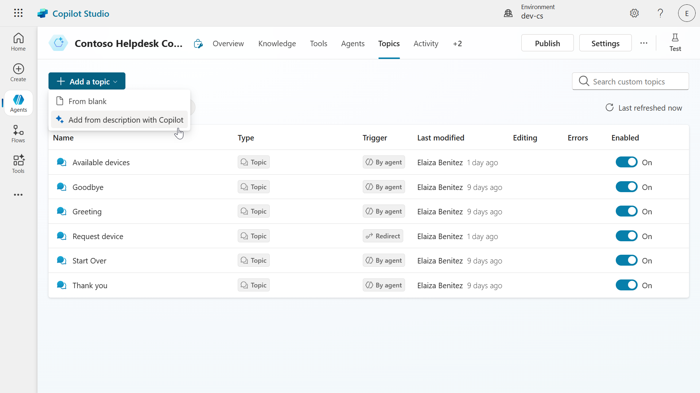

#### Why this is useful
- It gives you full control over how your agent responds.
- You can customize logic using variables, Power Fx, and conditions.
- It’s perfect for building tailored experiences for specific business needs.


### 2. Create with Copilot

This allows you to describe what you want using natural language, and Copilot will build the conversation for you. Same applies when editing your topic, use natural language and Copilot will review and modify the topic for you.

#### What Copilot supports
- Can create and edit:
    - Message nodes
    - Question nodes
    - Condition nodes
- Doesn’t support advanced settings such as how to reprompt the user if they don’t respond or how to manage interruptions during a question. You can still adjust those settings manually if needed.

#### Why this is useful
- Speeds up development with AI assistance.
- Lets you focus on logic and user experience instead of repetitive setup.
- Makes it easier to iterate and improve conversation flows with minimal effort.

#### ✨ Example prompts

 - **Create a topic**
    - <samp>Accept a user's name, age and date of birth and then repeat their responses back to them</samp>
    - <samp>Collect a user's street address, state and zip code. The user should be able to retry each question up to 4 times</samp>    

- **Edit a topic**
    - <samp>Add a question asking for the user’s date of birth</samp>
    - <samp>Summarize collected info in an Adaptive Card.</samp>

## 👩🏻‍🎨 OK, how do I design topics for my agent?

### 🧙🏻‍♂️ Step 1 - understand what users need

Start by identifying common questions or tasks users will ask your agent. These could be:

- Questions that users ask often such as, <samp>what's my entitlement for sick days?</samp>
- Common tasks users want to complete such as submitting a form
- Problems users often face such as login issues

### 📦 Step 2 - Group the scenarios

Organise the user needs into three categories based on what we learnt earlier - the purpose of a topic:

- Informational - the user wants to know something
- Task completion - the user wants to do something
- Troubleshooting - the user needs help with resolving an issue

### 🗺️ Step 3 - Map out the conversation

Sketch a simple conversation flow of how the agent should respond

- Start with a greeting or confirmation
- Ask follow-up questions to get details
- Provide answers or perform actions

> Tip: keep the conversation short and focused. Only ask what's necessary.

### 🔀 Step 4 - Handle different conversation types

Design for both:

- **Single-turn** - one question, one answer

- **Multi-turn** - a back and forth conversation with follow-up questions

Example:

- User: <samp>"I want to apply for vacation leave."</samp>

- Agent: <samp>"Sure! What date would you like your leave to start?"</samp>

- User: <samp>"July 15th."</samp>

- Agent: <samp>"Got it. And when will your leave end?"</samp>

- User: <samp>"July 22nd."</samp>

- Agent: <samp>"Thanks! What’s the reason for your leave??"</samp>

- User: <samp>"Family vacation."</samp>

- Agent: <samp>"Thanks for the details. I’ve submitted your leave request from July 15th to July 22nd for a family vacation. You’ll get a confirmation soon."

### 🤖 Step 5 - Use AI for unexpected questions

Even if you've designed a topic for leave requests, users might ask questions that aren't directly covered. This is where AI features like the _Conversational boosting_ system topic come in handy. 

This topic includes a generative answers node, which lets your agent start using connected knowledge sources right away. Any knowledge sources added at the agent level are automatically included in the generative answers node within the _Conversational boosting_ system topic.

#### Example

- User: <samp>"Can I carry over unused vacation days to next year?"</samp>

This question might not be part of your predefined topic flow, especially if your topic only handles submitting leave requests.

#### How AI helps

If your agent is connected to your company's HR policy documents or internal website, AI can:

- Search for the relevant leave policy
- Understand and summarize the rules
- Agent responds with: <samp>"According to the HR policy, you can carry over unused vacation days to the next calendar year. For more details, check the leave policy section on the HR portal."</samp>

#### Why this is useful

- You don't need to manually create a topic for every policy-related question.
- AI can pull accurate answers from trusted knowledge sources.
- It improves user experience by making the agent feel smarter and more responsive.

### 🔬 Step 6 - Test the topic, the conversation flow

Before publishing your topic:

- Test using real questions or real sample inputs.
- Make sure it sounds natural and helpful.

> Tip: Apply improvements to your topic accordingly as you test, such as adding more nodes or removing nodes in-place of redirecting to another topic

### ⚠️ Step 7 - Avoid duplicating website content

Don't copy what's already on your website.

- Focus on topics that users ask about often.
- Add new topics based on chat history or support requests.

### ✨ Example of conversation flow

Below is an example of a topic that handles leave requests.

**Step 1: Trigger phrase**

User types, 
    
<samp>I want to request vacation leave</samp>

**Step 2: Agent asks for details using an Adaptive card**

Agent asks,

<samp>Sure! What dates would you like to take off?</samp>

Adaptive card has a start date and end date calendar picker control.

**Step 3: User provides dates**

User selects start date as August 5 2025 and end date August 10 2025, and submits card. Date values are stored in the output of the adaptive card as variables.

**Step 4: Cloud flow executed**

A Power Automate cloud flow has been executed which creates a new request in leave management system and sends an email to notify manager of leave request.

**Step 5: Send a confirmation message to the user**

Agent responds with,

<samp>Your vacation leave request from August 5 to August 10 has been submitted. Your manager will review and get back to you shortly.</samp>

## 🧪 Lab 07 - Add a new topic with conversation nodes

We're now going to learn how to add a new topic with a trigger and tools. This lab will cover creating a topic from blank so that you understand how to customize topics to your needs.

- [7.1 Add a new topic from blank](/07-add-new-topic-with-trigger/README.md/#71-add-a-new-topic-from-blank)
- [7.2 Add node - Ask a Question and create a custom entity](/07-add-new-topic-with-trigger/README.md/#72-add-node---ask-a-question-and-create-a-custom-entity)
- [7.3 Add a tool using the SharePoint connector](/07-add-new-topic-with-trigger/README.md/#73-add-node---add-a-tool-using-a-connector)

### ✨ Use case

**As an** employee

**I want to** know what devices are available

**So that I** have a list of available devices

Let's begin!

### Prerequisites

1. **SharePoint list**

    We'll be using the **Devices** SharePoint list from [Lesson 00 - Course Setup - Step 3: Create new SharePoint site](/00-course-setup/README.md/#step-3-create-new-sharepoint-site). 
    
    If you have not set up the **Devices** SharePoint list, please head back to [Lesson 00 - Course Setup - Step 3: Create new SharePoint site](/00-course-setup/README.md/#step-3-create-new-sharepoint-site).

1. **Contoso Helpdesk Copilot**

    We're going to use the same agent created previously in [Lesson 06 - Create a custom agent using natural language with Copilot and grounding it with your data](/06-create-agent-from-conversation/README.md).

### 7.1 Add a new topic from blank

1. In the overview tab of the agent, scroll down to the **Topics** section. Select **See all**.

    

1. The **Topics** tab will load and by default the _Custom_ topics will be displayed. You can filter topics by All, Custom and System. The custom and system topics you currently see were created automatically when the agent was provisioned.

    

1. Select **+ Add a topic** and select **From blank**.

    

1. Enter a name for the trigger and a trigger description that outlines what the topic does. Below are suggestions.

    **Name**

    ```
    Available devices
    ```

    **Trigger description**

    ```
    This topic helps users find devices that are available from our SharePoint Devices list. User can ask to see available devices and it will return a list of devices that are available which can include laptops, smartphones, accessories and more.
    ```

    

### 7.2 Add node - Ask a Question and create a custom entity

1. Next, we're going to add a new node. Select the **+ icon** below the trigger and select the **Ask a question** node.

    

    

1. Enter a question to ask the user to confirm the type of device. Copy and paste the following as the question.

    ```
    What type of device are you looking for?
    ```

    

1. We're now going to create a new custom entity which teaches the agent to recognize specific types of information. 

    In our use case, the custom entity will help the agent understand device types. We'll create a **_Closed List entity_** which is best for short, manageable lists such as product types or service categories.

    Select the **> icon** by the _Multiple choice options_ and select **Create an Entity**.

    

1. You'll see two custom entity options, **_Closed List_** which was explained in the previous step, and **_Regular Expression_** (Regex). Regex entities are great for matching patterns such as tracking numbers, license plates, debit/credit card numbers etc.

    For this use case, select **Closed List**, as we're going to define the types of devices a user can select.

    

1. We can now define our Closed List entity. A name, description and items need to be entered. 

    | Field    | Value |
    | ---------- | :--------- |
    | Name | Device type |
    | Description  | Device types at our company |
    | Add item   | laptop   |
    | Add item    | desktop   |
    | Add item    | smartphone   |

    To enter an item, enter the device type and select **Add**.

    

1. Enable **Smart switching** to **on** and select **Save**.

    

1. We now need to display the options for the user to select. Click **Select options for user**.

    

1. Tick all three checkboxes for the list values.

    

1. Next, we need to name the variable for the output of the question node. This variable will be used in the next node. Select the `Var1` variable.

    

1. Rename the variable to the following,

    ```
    VarDeviceType
    ```

    

### 7.3 Add node - Add a tool using a connector

1. Let's next add a node that enables the agent to retrieve the list of devices from the **Devices** SharePoint list. Select the **+ icon** below the trigger and select the **Add a tool** node. Select the **Connector** tab.

    

1. Search for `Get items` and select the **Get items** SharePoint connector action

    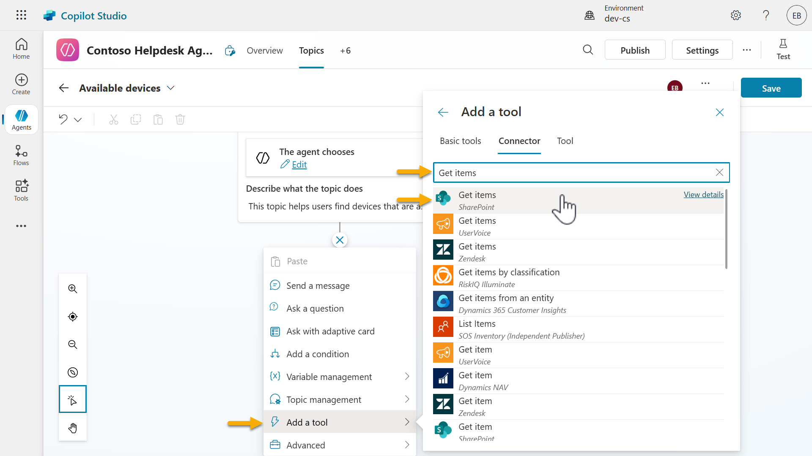

1. A new connection needs to be created for the connector. Select the **chevron** icon and select **Create new connection**.

    

1. Two options will be displayed that allows you to connect directly to SharePoint Online or to an on-premises SharePoint. By default the **Connect directly (cloud-services)** option will be selected, which is what we'll use for our connection.

    Select **Create**.

    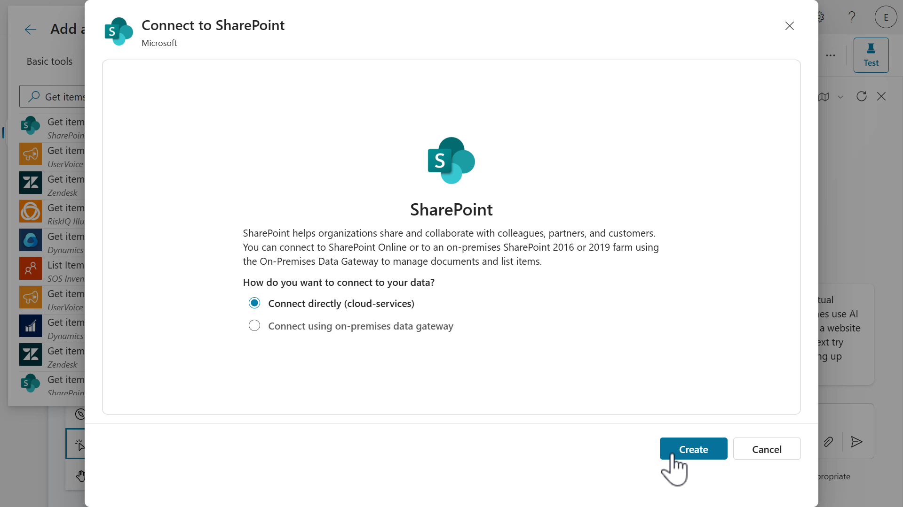

1. Select your signed in user account.

    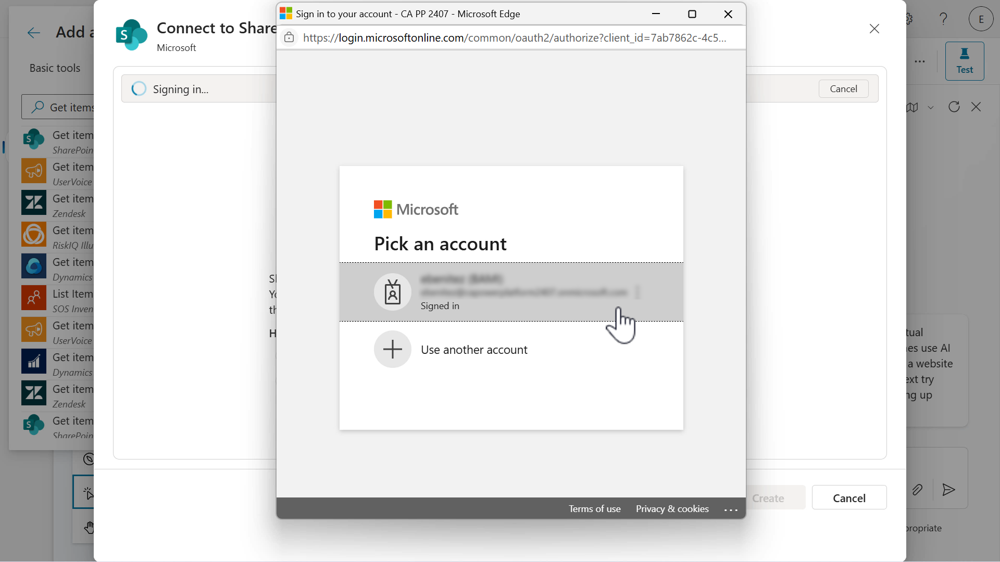

1. Next, you need to confirm your user account can be used for the connection to the SharePoint connector. Select **Allow access**.

    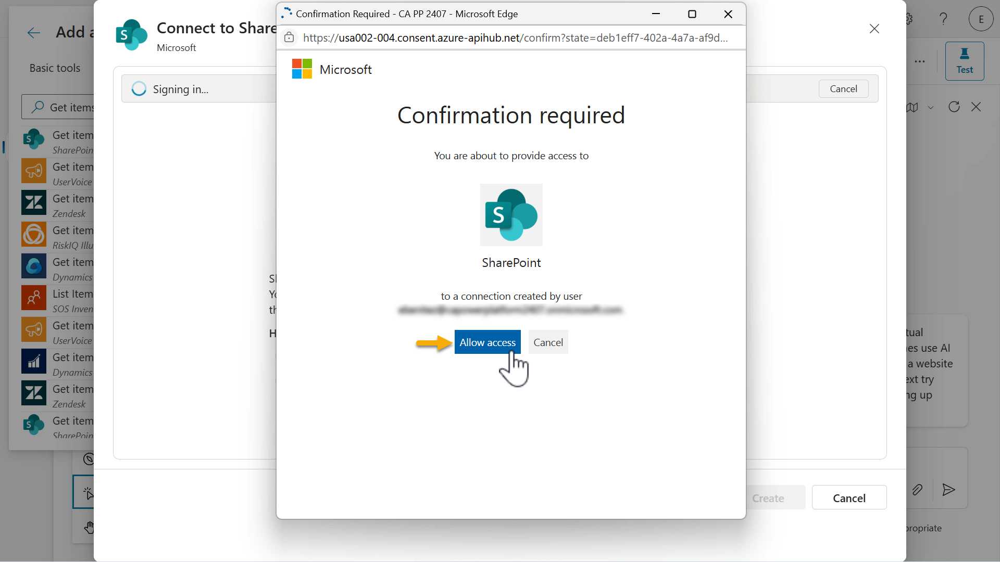

1. Select **Submit** for the **Get items** SharePoint connector action to be added as a node to the topic.

    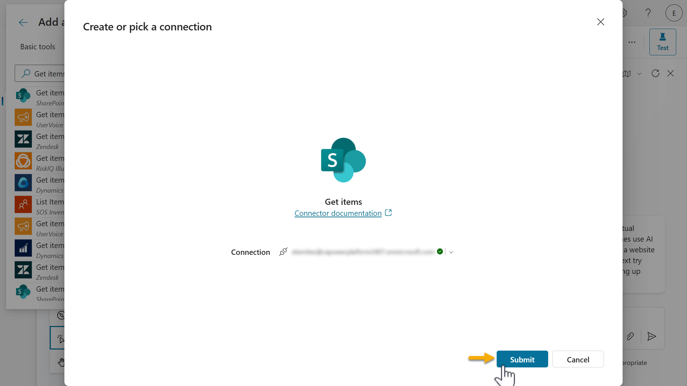

1. The **Get items** SharePoint connector action is now added to the topic. We can now begin configuring the inputs of the action. Select any of the input parameters, such as **List Name**.

    

1. The **Get items** configuration pane will appear and by default, you'll see the **Inputs** tab. Select the **Initiation** tab.

    

1. Enter a description in the **Usage Description** field.

    > This will come in handy when we view the _Manage your connections_ page of our agent. We'll return to this shortly.

    

1. Select the **Inputs** tab and select the site and the SharePoint list that you setup in [Lesson 00 - Course Setup - Step 3: Create new SharePoint site](/00-course-setup/README.md/#step-3-create-new-sharepoint-site).

    

1. Now, to only display devices from the SharePoint list based on 
    - the selected value, 
    - and only devices where the status equals _Available_, 
    
    we need to apply a filter. This is achieved by entering a filter query with the help of [Power Fx](/07-add-new-topic-with-trigger/README.md/#️-using-power-fx-in-your-nodes). Select the **ellipsis ... icon**.

    

1. By default, you'll be in the **Custom** tab. Select the **Formula** tab and copy and paste the following Power Fx expression. 

    We are using the `Concatenate` function to create an expression that will filter 
    - the SharePoint column of **Status** equals _Available_
    - and the SharePoint column of **Asset type** equals _the selected device from the question node_.

    ```
    Concatenate("Status eq 'Available' and AssetType eq '", Topic.VarDeviceType, "'")
    ```

    Select **Insert**.

    

1. The Power Fx expression will now be applied in the Filter Query input parameter of the **Get items** action.

    

1. Next, we'll update the name of the variable for the output. Select the **Outputs** tab and select the `GetItems` variable.

    

1. Update the name to the following.

    ```
    VarDevices
    ```

    

1. Scroll down and in the **Usage** section, select **Global**. This will make the variable accessible by any topic.

    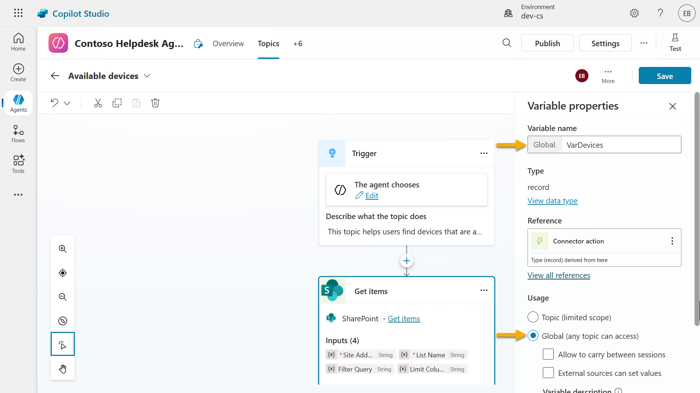

1. To verify that the Get items SharePoint connector action succeeded, add a **Send a message** node below the **Get items** tool node where we'll next insert the response in the body of the message. 

    

1. Select the **{x}** icon to insert a variable which will be the output of the Get items SharePoint connector action.

    

1. Select the **VarDevices.value** variable. This is the `value` property in the JSON response of the Get items SharePoint connector action.

    

1. **Save** the topic.

    

1. Test the topic by entering the following.

    ```
    I need a device
    ```

    

1. We'll now see our _Device types Closed List_ and its item values displayed. Select `laptop`.

    

1. Before the agent can proceed, the user needs to verify their connection through the _Manage your connections_ page of the agent. Select **Open connection manager**.

    

1. Before we select **Connect** to verify the connection, select **1 tool** in the **Used By** column.

    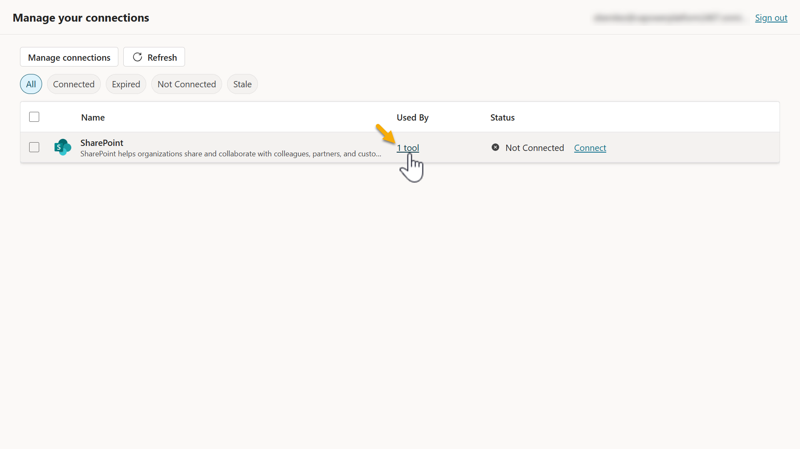

1. This is where we can see the details of the Get items action and remember the _usage description_ we entered earlier? This is where we'll see the usage description. Select **Close**.

    > This lets us know what actions are used and the purpose of it. This keeps our connections organized 📁.

    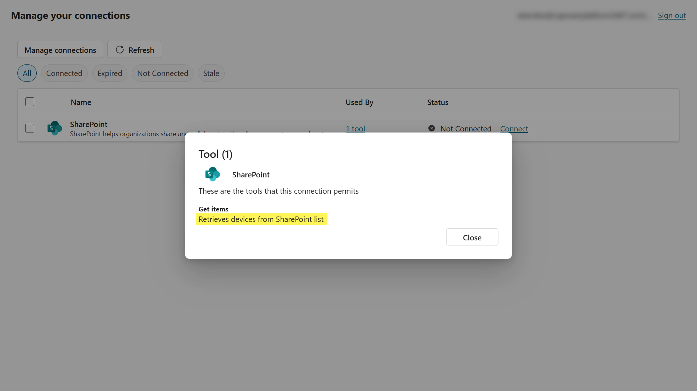

1. Select **Connect**.

    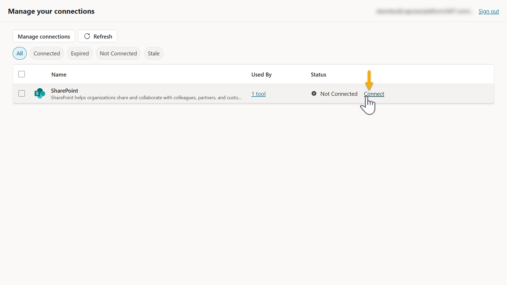

1. A new modal will appear where you can create or select an existing connection. 

    Since we created a connection earlier, by default it is using this connection so we'll leave it as-is. Select **Submit**.

    

1. Go back to your browser tab with Copilot Studio and in the test pane, select **Retry**.

    

1. We'll now see the JSON response of the `value` property. This confirms that the SharePoint action succeeded in retrieving the devices where the status equals availabile and the device type equals laptop.

    

1. Refresh the test pane to clear the test and close the activity map.

## Next lesson
Congratulations! 👏🏻 You've learnt how to add a new topic from scratch, how to add a tool which calls the Get items SharePoint connector action and use Power Fx to filter the response to only return devices where the status equals availabile and the device type equals laptop. 🙌🏻

This is the end of **Lab 07 - Add a new topic with conversation nodes**, select the link below to move to the next lesson. We'll expand on the use case in this lab in the following lesson's lab.

⏭️ [Move to **Enhance user interactions with Adaptive Cards** lesson](/08-add-adaptive-card/README.md)


## 📚 Additional learning
🔗 [Use system topics](https://learn.microsoft.com/en-us/microsoft-copilot-studio/authoring-system-topics?mc_id=power-170631-ebenitez)

🔗 [Topics in Microsoft Copilot Studio](https://learn.microsoft.com/en-us/microsoft-copilot-studio/guidance/topics-overview?WT.mc_id=power-170631-ebenitez)

🔗 [Set topic triggers](https://learn.microsoft.com/en-us/microsoft-copilot-studio/authoring-triggers?WT.mc_id=power-170631-ebenitez)


🔗 [Defining agent topics](https://learn.microsoft.com/en-us/microsoft-copilot-studio/guidance/defining-chatbot-topics?WT.mc_id=power-170631-ebenitez)

🔗 [Create expressions using Power Fx](https://learn.microsoft.com/en-us/microsoft-copilot-studio/advanced-power-fx?WT.mc_id=power-170631-ebenitez)

📺 [Author topics using natural language](aka.ms/ai-in-action/copilot-studio/ep6)

📺 [Add actions to agents using conenctors](aka.ms/ai-in-action/copilot-studio/ep4)

