# 🚨 Mission 11: Publish Your Agent

## 🕵️‍♂️ CODENAME: `OPERATION PUBLISH PUBLISH PUBLISH`

> **⏱️ Operation Time Window:** `~30 minutes`  

## 🎯 Mission Brief

After completing a series of challenging modules, Agent Maker, you're now ready for your most critical step yet: publishing your agent. It’s time to make your creation available to users across Microsoft Teams and Microsoft 365 Copilot.

Your agent—equipped with a clear mission, powerful tools, and access to key knowledge sources—is ready to serve. Using Microsoft Copilot Studio, you deploy your agent so it can start assisting real users, right where they work.

Let’s launch your agent into action.

## 🔎 Objectives

📖 This lesson covers:

- [🚀 Publish an agent](#-publish-an-agent)
- [⚙️ Configure channels](#️-configure-channels)
- [📺 Channel experiences](#-channel-experiences)
- [🧪 Lab 11: Publish your agent to Teams and Microsoft 365 Copilot](#-lab-11-publish-your-agent-to-teams-and-microsoft-365-copilot)
  - [11.1 Publish your agent](#111-publish-your-agent)
  - [11.2 Add the Teams and Microsoft 365 Copilot channel](#112-add-the-teams-and-microsoft-365-copilot-channel)
  - [11.3 Make the agent available for all users in the tenant](#113-make-the-agent-available-for-all-users-in-the-tenant)
- [📚 Tactical Resources](#-tactical-resources)

## 🚀 Publish an agent

Every time you work on an agent in Copilot Studio you might update it by adding knowledge or tools. When you're ready with all the changes, and you tested thoroughly, you're ready to publish it. Publishing ensures that the latest updates are live. When you update your agent with new tools, and you don't hit the publish button, it's not available yet for end users.

Make sure to always hit the publish button when you want to push the updates to the users of your agent. Your agent might have channels added to it and when you hit publish the updates are available for all the channels you added to the agent.

## ⚙️ Configure channels

Channels determine where your users can access and interact with your agent. After you publish your agent, you can make it available in multiple channels. Each channel may display your agent's content differently.

You can add your agent to the following channels:

- **Microsoft Teams and Microsoft 365 Copilot** - Make your agent available in Teams chats and meetings, and within Microsoft 365 Copilot experiences ([Learn more](https://learn.microsoft.com/microsoft-copilot-studio/publication-add-bot-to-microsoft-teams))
- **Demo website** - Test your agent on a demo website provided by Copilot Studio ([Learn more](https://learn.microsoft.com/microsoft-copilot-studio/publication-connect-bot-to-web-channels))
- **Custom website** - Embed your agent directly into your own website ([Learn more](https://learn.microsoft.com/microsoft-copilot-studio/publication-connect-bot-to-web-channels))
- **Mobile app** - Integrate your agent into a custom mobile application ([Learn more](https://learn.microsoft.com/microsoft-copilot-studio/publication-connect-bot-to-custom-application))
- **SharePoint** - Add your agent to SharePoint sites for document and site assistance ([Learn more](https://learn.microsoft.com/microsoft-copilot-studio/publication-add-bot-to-sharepoint))
- **Facebook Messenger** - Connect with users through Facebook's messaging platform ([Learn more](https://learn.microsoft.com/microsoft-copilot-studio/publication-add-bot-to-facebook))
- **Power Pages** - Integrate your agent into Power Pages websites ([Learn more](https://learn.microsoft.com/microsoft-copilot-studio/publication-add-bot-to-power-pages))
- **Azure Bot Service channels** - Access additional channels including Slack, Telegram, Twilio SMS, and more ([Learn more](https://learn.microsoft.com/microsoft-copilot-studio/publication-connect-bot-to-azure-bot-service-channels))

To add a channel, navigate to the **Channels** tab in your agent and select the channel you want to configure. Each channel has specific setup requirements and may require additional authentication or configuration steps.

## 📺 Channel experiences

Different channels have different user experiences. When building an agent for multiple channels, make sure to be aware of the differences per channel. It's always a good strategy to test your agent in multiple channels to see if it really does what you intended.

| Experience                        | Website       | Teams and Microsoft 365 Copilot         | Facebook                 | Dynamics Omnichannel for Customer Service                   |
| --------------------------------- | ------------- | --------------------------------------- | ------------------------ | ----------------------------------------------------------- |
| [Customer satisfaction survey][1] | Adaptive card | Text-only                               | Text-only                | Text-only                                                   |
| [Multiple-choice options][1]      | Supported     | [Supported up to six (as hero card)][4] | [Supported up to 13][6]  | [Partially Supported][8]                                    |
| [Markdown][2]                     | Supported     | [Partially Supported][5]                | [Partially supported][7] | [Partially Supported][9]                                    |
| [Welcome message][1]              | Supported     | Supported                               | Not supported            | Supported for [Chat][10]. Not supported for other channels. |
| [Did-You-Mean][3]                 | Supported     | Supported                               | Supported                | Supported for [Microsoft Teams][11], [Chat][10], Facebook, and text-only channels (short message service (SMS) via [TeleSign][12] and [Twilio][13], [WhatsApp][14], [WeChat][15], and [Twitter][16]). Suggested actions are presented as a text-only list; users must retype an option to respond. |

[1]: https://learn.microsoft.com/microsoft-copilot-studio/authoring-create-edit-topics
[2]: https://daringfireball.net/projects/markdown/
[3]: https://learn.microsoft.com/microsoft-copilot-studio/advanced-ai-features
[4]: https://learn.microsoft.com/microsoftteams/platform/concepts/cards/cards-reference#hero-card
[5]: https://learn.microsoft.com/microsoftteams/platform/bots/how-to/format-your-bot-messages#text-only-messages
[6]: https://developers.facebook.com/docs/messenger-platform/send-messages/quick-replies/
[7]: https://www.facebook.com/help/147348452522644?helpref=related
[8]: https://learn.microsoft.com/dynamics365/customer-service/asynchronous-channels#suggested-actions-support
[9]: https://learn.microsoft.com/dynamics365/customer-service/asynchronous-channels#preview-support-for-formatted-messages
[10]: https://learn.microsoft.com/dynamics365/customer-service/set-up-chat-widget
[11]: https://learn.microsoft.com/dynamics365/customer-service/configure-microsoft-teams
[12]: https://learn.microsoft.com/dynamics365/customer-service/configure-sms-channel
[13]: https://learn.microsoft.com/dynamics365/customer-service/configure-sms-channel-twilio
[14]: https://learn.microsoft.com/dynamics365/customer-service/configure-whatsapp-channel
[15]: https://learn.microsoft.com/dynamics365/customer-service/configure-wechat-channel
[16]: https://learn.microsoft.com/dynamics365/customer-service/configure-twitter-channel

> [!NOTE]
> There are some examples of where you can use different logic for different channels. An example of it can be found in the Power Platform Snippets repository:
>
> Henry Jammes shared an example of how to show a different adaptive card when the channel is Microsoft Teams. ([Link to example](https://github.com/pnp/powerplatform-snippets/blob/main/copilot-studio/multiple-topics-matched-topic/source/multiple-topics-matched.yaml#L40))

## 🧪 Lab 11: Publish your agent to Teams and Microsoft 365 Copilot

### 🎯 Use case

Your Contoso IT Help Desk agent is now fully configured with powerful capabilities—it can access SharePoint knowledge sources, create support tickets, send proactive notifications, and respond intelligently to user queries. However, all these features are currently only available in the development environment where you built them.

**The Challenge:** End users can't benefit from your agent's capabilities until it's properly published and made accessible through the channels where they actually work.

**The Solution:** Publishing your agent ensures that the latest version—with all your recent updates, new topics, enhanced knowledge sources, and configured flows—is available to real users. Without publishing, users would still interact with an older version of your agent that might be missing critical functionality.

Adding the Teams and Microsoft 365 Copilot channel is equally crucial because:

- **Teams Integration**: Your organization's employees spend most of their day in Microsoft Teams for collaboration, meetings, and communication. By adding your agent to Teams, users can get IT support without leaving their primary work environment.

- **Microsoft 365 Copilot**: Users can access your specialized IT help desk agent directly within their Microsoft 365 Copilot experience, making it seamlessly integrated into their daily workflow across Office applications.

- **Centralized Access**: Instead of remembering separate websites or applications, users can access IT support through the platforms they're already using, reducing friction and increasing adoption.

This mission transforms your development work into a production-ready solution that delivers real value to your organization's end users.

### Prerequisites

Before starting this lab, ensure you have:

- ✅ Completed previous labs and have a fully configured Contoso Helpdesk Agent
- ✅ Your agent has been tested and is ready for production use
- ✅ Permissions in your Copilot Studio environment to publish agents
- ✅ Access to Microsoft Teams in your organization

### 11.1 Publish your agent

Now that all our work on the agent is done, we have to make sure all our work is available for the end users that are going to use our agent. To make sure the content is available for all users, we need to publish our agent.

1. Go to the Contoso Helpdesk Agent in Copilot Studio (via the [Copilot Studio maker portal](https://copilotstudio.microsoft.com))

    In Copilot Studio, it's easy to publish your agent. You can just select the publish button at the top of the agent overview.

    

1. Select the **Publish** button in your agent

    It opens the publish pop-up - to confirm you really want to publish your agent.

    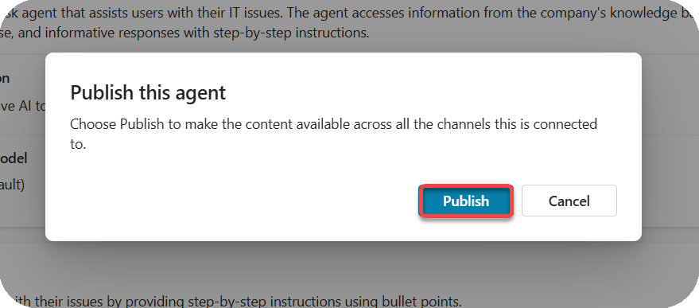

1. Select **Publish** to confirm publishing your agent

    Now a message shows that your agent is publishing. You don't have to keep that popup open. You get notified when the agent is published.

    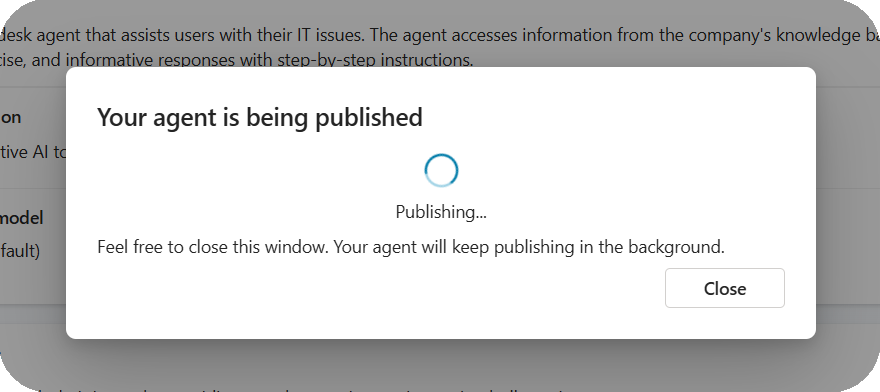

    When the agent is done publishing, you see the notification at the top of the agent page.

    

But - we only published the agent, we didn't add it to a channel yet, so lets fix that now!

### 11.2 Add the Teams and Microsoft 365 Copilot channel

1. To add the Teams and Microsoft 365 Copilot channel to our agent, we need to select **Channel** in the top navigation of the agent

    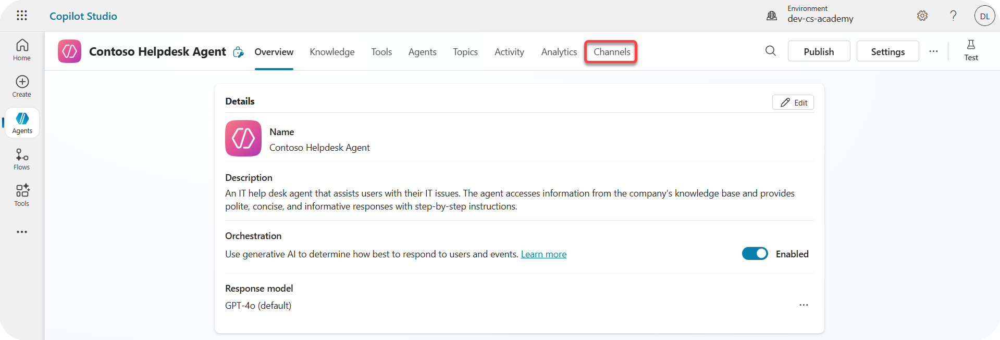

    Here we can see all the channels we can add to this agent.

1. Select **Teams and Microsoft 365**

    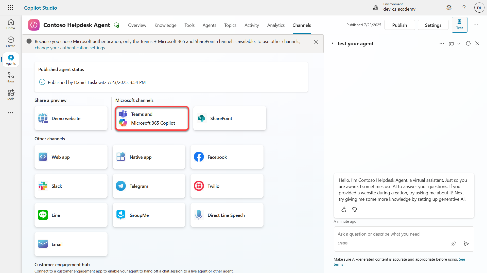

1. Select **Add channel** to complete the wizard and add the channel to the agent

    

    It will take a little while until it's added. After it's added a green notification will appear on the top of the sidebar.

    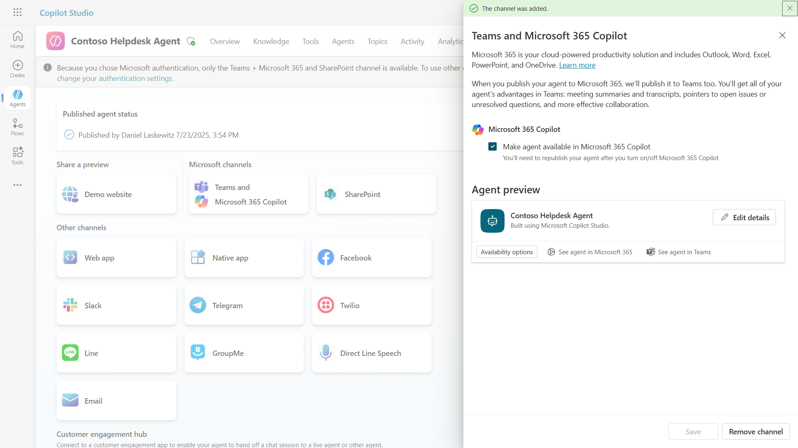

1. Select **See agent in Teams** to open a new tab

    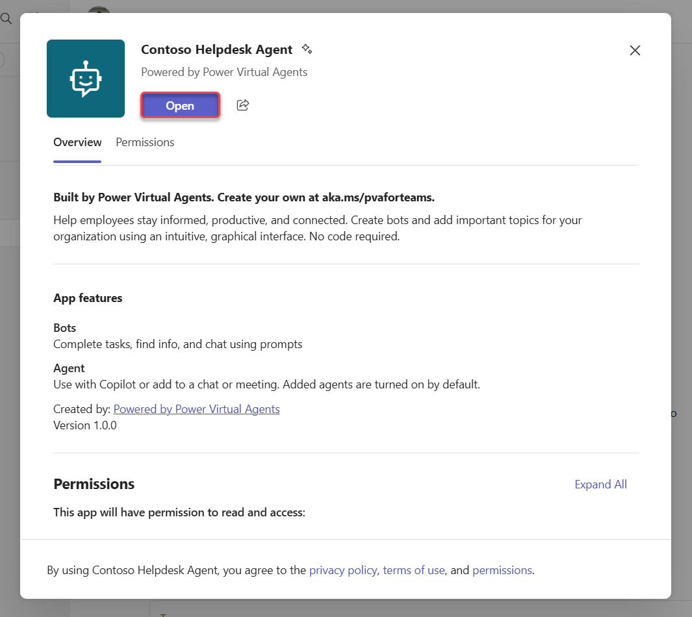

1. Select **Add** to add the Contoso Helpdesk Agent to Teams

    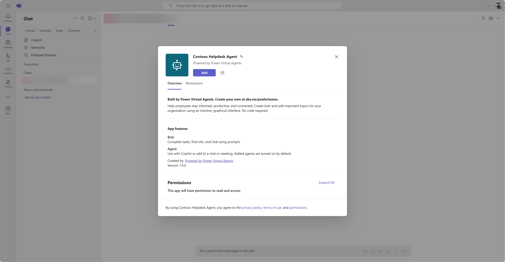

    This should take a little while. After it should show the following screen:

    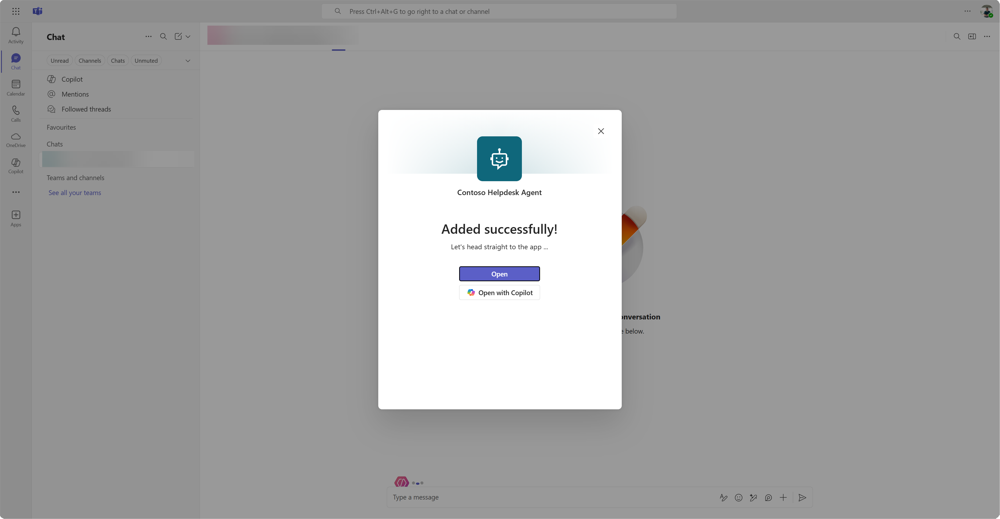

1. Select **Open** to open the agent in Teams

    This will open the agent in Teams as a Teams app

    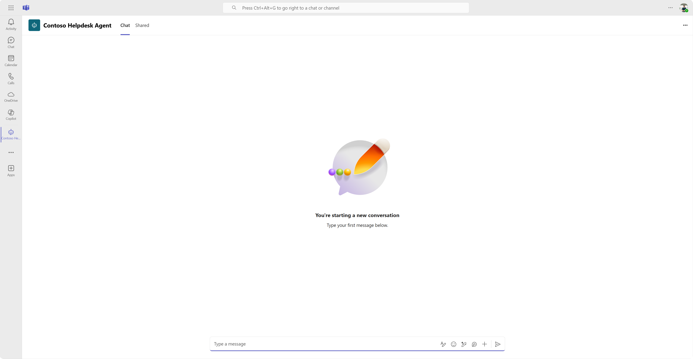

Now we have published the agent to work for you in Microsoft Teams, but you might want to make this available for more people.

### 11.3 Make the agent available for all users in the tenant

1. Close the browser tab where the Contoso Helpdesk Agent is opened

    This should bring you back to Copilot Studio where the Teams and Microsoft 365 Copilot side panel is still open. We only opened the agent in Teams now, but we can do a lot more here. We can edit the details of the agent, we can deploy the agent to more users and more.

1. Select **Edit details**

    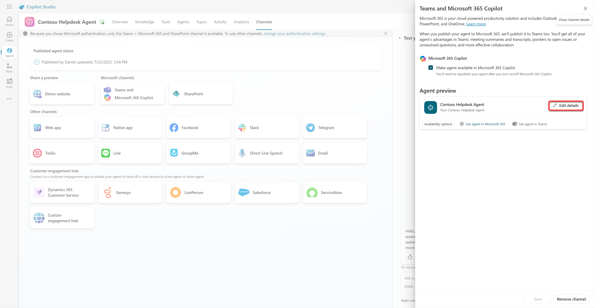

    This will open a pane where we can change a bunch of details and settings of the agent. We can change basic details like the icon, the background color of the icon and the descriptions. We can also change Teams settings (for instance allowing a user to add the agent to a team, or allowing to use this agent in group and meeting chats) here. When you select *more*, you can also change developer details like the developer name, the website, the privacy statement and the terms of use.

    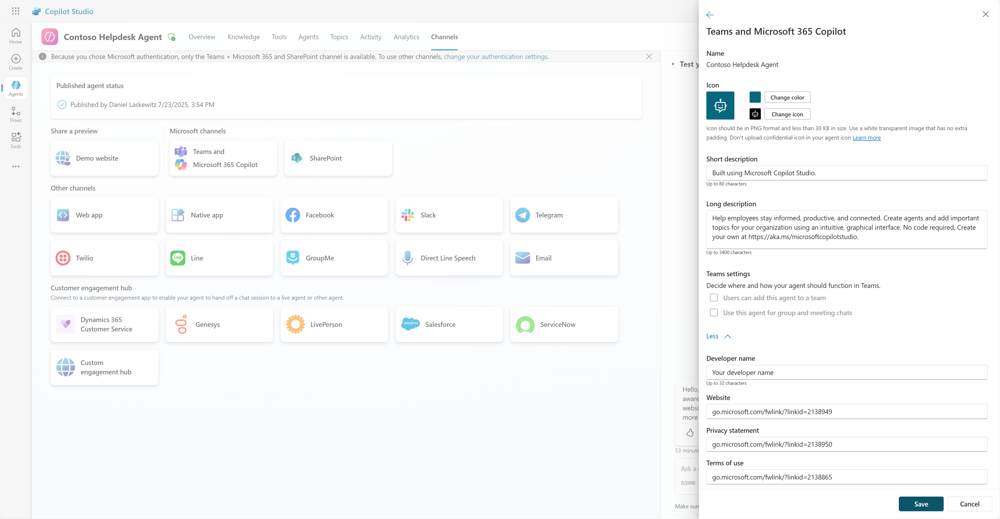

1. Select **Cancel** to close the Edit details pane

1. Select **Availability options**

    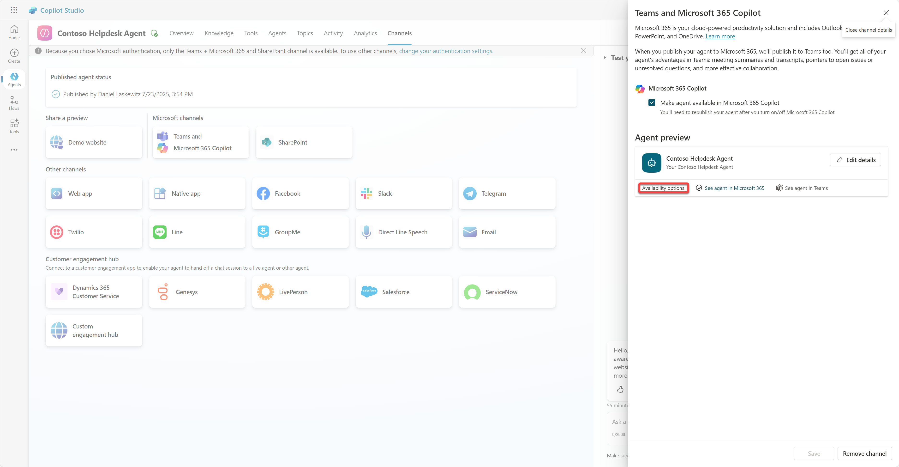

    This will open the availability options pane, where you can copy a link to send to users to use this agent (be aware, you need to share the agent with the user too) and you can download a file to add your agent to the Microsoft Teams or Microsoft 365 store. To show the agent in the store, you have other options too: you can show it to your teammates and shared users (to show in the *Built with Power Platform* section) or you can show it to everyone in your org (this needs administrator approval).

1. Select **Show to everyone in my org**

    

1. Select **Submit for admin approval**

    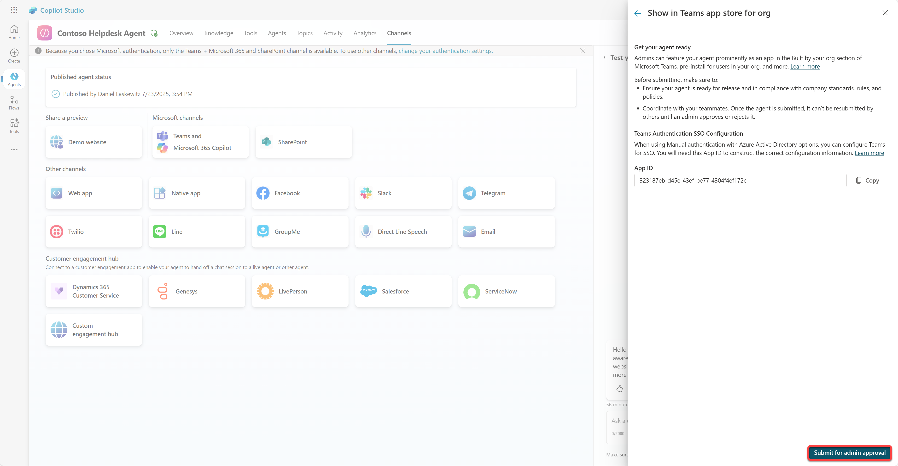

    Now, your administrator has to approve your agent submission. They can do that by going to the Teams Admin Center and look up the Contoso Helpdesk Agent in Apps. In the screenshot you can see what the administrator would see in Teams Admin Center.

    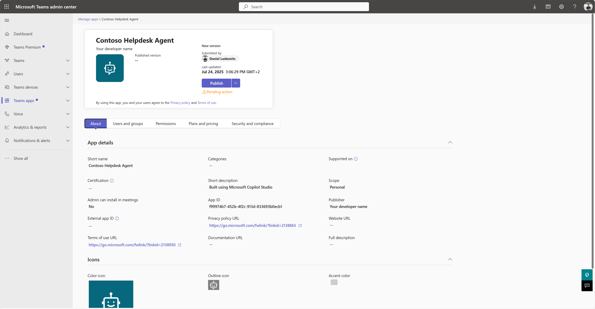

    When the administrator has published the agent submission, you will be able to refresh Copilot Studio and you should see the *available in app store* banner in the availability options.

    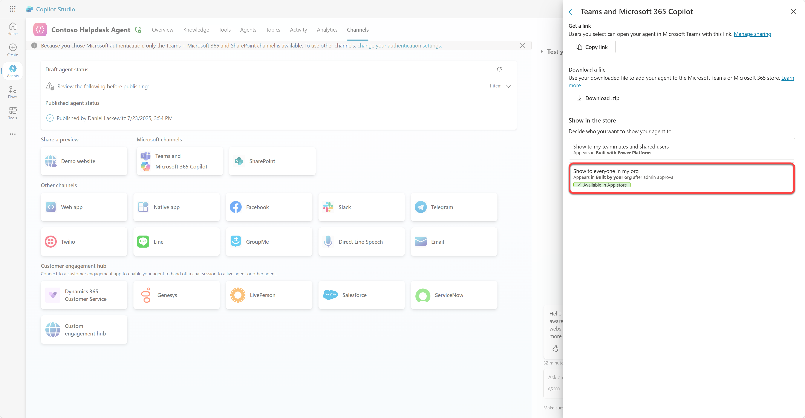

## ✅ Mission Complete

🎉 **Congratulations!** You successfully published your agent and added it to Teams and Microsoft 365 Copilot! It also marks the end of the course! Congratulations on finishing this course! You're now a certified Agent Academy Recruit!

⏭️ [Move back to the **course overview**](./../README.md).

## 📚 Tactical Resources

🔗 [Publish channels documentation](https://learn.microsoft.com/microsoft-copilot-studio/publication-fundamentals-publish-channels)
