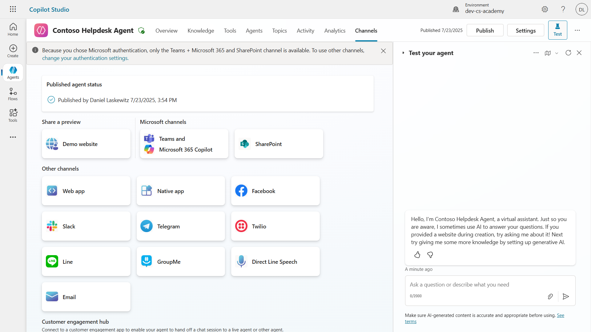
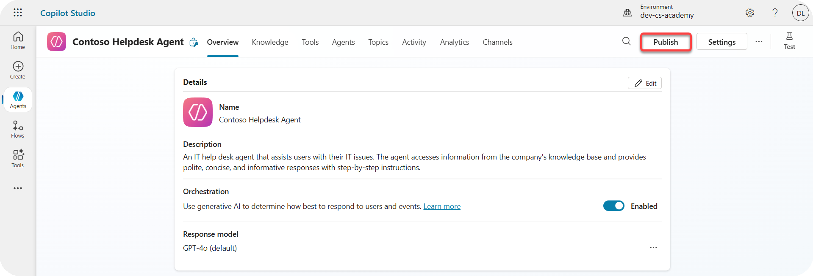

# 🚨 Mission 11: Publish Your Agent

## 🕵️‍♂️ CODENAME: `OPERATION PUBLISH PUBLISH PUBLISH`

> **⏱️ Operation Time Window:** `~30 minutes`  

## 🎯 Mission Brief

After completing a series of challenging modules, Agent Maker, you are now ready for your most critical step yet: publishing your agent. It’s time to make your creation available to users across Microsoft Teams and Microsoft 365 Copilot.

Your agent—equipped with a clear mission, powerful tools, and access to key knowledge sources—is ready to serve. Using Microsoft Copilot Studio, you’ll deploy your agent so it can start assisting real users, right where they work.

Let’s launch your agent into action.

## 🔎 Objectives

📖 This lesson will cover:

- [🚀 Publish an agent](#-publish-an-agent)
- [⚙️ Configure channels](#️-configure-channels)
- [📺 Channel experiences](#-channel-experiences)
- [📚 Tactical Resources](#-tactical-resources)

## 🚀 Publish an agent

Every time you work on an agent in Copilot Studio you might update it by adding knowledge or tools. When you are ready with all the changes, and you have tested thoroughly, you are ready to publish it. Publishing ensures that the latest updates will be live. So, this means that when you update your agent with new tools, and you don't hit the publish button, it's not available yet for end users.

Make sure to always hit the publish button when you want to push the updates to the users of your agent. You agent might have channels added to it and when you hit publish the updates will be available for all the channels you added to the agent.

## ⚙️ Configure channels

Channels are places where your agent appears. The connection steps are different for each channel. For more information, see the article for the desired channels, in the following list:

- Teams and Microsoft 365 Copilot ([Learn more](https://learn.microsoft.com/microsoft-copilot-studio/publication-add-bot-to-microsoft-teams))
- SharePoint ([Learn more](https://learn.microsoft.com/microsoft-copilot-studio/publication-add-bot-to-sharepoint))
- Demo Website ([Learn more](https://learn.microsoft.com/microsoft-copilot-studio/publication-connect-bot-to-web-channels))
- Custom Website ([Learn more](https://learn.microsoft.com/microsoft-copilot-studio/publication-connect-bot-to-web-channels))
- Mobile App ([Learn more](https://learn.microsoft.com/microsoft-copilot-studio/publication-connect-bot-to-custom-application))
- Facebook ([Learn more](https://learn.microsoft.com/microsoft-copilot-studio/publication-add-bot-to-facebook))
- Power Pages ([Learn more](https://learn.microsoft.com/microsoft-copilot-studio/publication-add-bot-to-power-pages))
- Azure Bot Service channels ([Learn more](https://learn.microsoft.com/microsoft-copilot-studio/publication-connect-bot-to-azure-bot-service-channels)), these include Skype, Cortana, Slack, Telegram, Twilio, Line, Kik, GroupMe, Direct Line Speech & Email.

## 📺 Channel experiences

Different channels have different user experiences. When building an agent for multiple channels, make sure to be aware of the differences per channel. In the table below, you can find experiences that can be different per channel. Of course - it's always a good strategy to test your agent in multiple channels to see if it really does what you intended.

| Experience                        | Website       | Teams and Microsoft 365 Copilot         | Facebook                 | Dynamics Omnichannel for Customer Service                   |
| --------------------------------- | ------------- | --------------------------------------- | ------------------------ | ----------------------------------------------------------- |
| [Customer satisfaction survey][1] | Adaptive card | Text-only                               | Text-only                | Text-only                                                   |
| [Multiple-choice options][1]      | Supported     | [Supported up to six (as hero card)][4] | [Supported up to 13][6]  | [Partially Supported][8]                                    |
| [Markdown][2]                     | Supported     | [Partially Supported][5]                | [Partially supported][7] | [Partially Supported][9]                                    |
| [Welcome message][1]              | Supported     | Supported                               | Not supported            | Supported for [Chat][10]. Not supported for other channels. |
| [Did-You-Mean][3]                 | Supported     | Supported                               | Supported                | Supported for [Microsoft Teams][11], [Chat][10], Facebook, and text-only channels (short message service (SMS) via [TeleSign][12] and [Twilio][13], [WhatsApp][14], [WeChat][15], and [Twitter][16]). Suggested actions are presented as a text-only list; users must retype an option to respond. |

[1]: https://learn.microsoft.com/microsoft-copilot-studio/authoring-create-edit-topics
[2]: https://daringfireball.net/projects/markdown/
[3]: https://learn.microsoft.com/microsoft-copilot-studio/advanced-ai-features
[4]: https://learn.microsoft.com/microsoftteams/platform/concepts/cards/cards-reference#hero-card
[5]: https://learn.microsoft.com/microsoftteams/platform/bots/how-to/format-your-bot-messages#text-only-messages
[6]: https://developers.facebook.com/docs/messenger-platform/send-messages/quick-replies/
[7]: https://www.facebook.com/help/147348452522644?helpref=related
[8]: https://learn.microsoft.com/dynamics365/customer-service/asynchronous-channels#suggested-actions-support
[9]: https://learn.microsoft.com/dynamics365/customer-service/asynchronous-channels#preview-support-for-formatted-messages
[10]: https://learn.microsoft.com/dynamics365/customer-service/set-up-chat-widget
[11]: https://learn.microsoft.com/dynamics365/customer-service/configure-microsoft-teams
[12]: https://learn.microsoft.com/dynamics365/customer-service/configure-sms-channel
[13]: https://learn.microsoft.com/dynamics365/customer-service/configure-sms-channel-twilio
[14]: https://learn.microsoft.com/dynamics365/customer-service/configure-whatsapp-channel
[15]: https://learn.microsoft.com/dynamics365/customer-service/configure-wechat-channel
[16]: https://learn.microsoft.com/dynamics365/customer-service/configure-twitter-channel

> [!NOTE]
> There are some examples of where you can use different logic for different channels. An example of it can be found in the Power Platform Snippets repository:
>
> Henry Jammes shared an example of how to show a different adaptive card when the channel is Microsoft Teams. ([Link to example](https://github.com/pnp/powerplatform-snippets/blob/main/copilot-studio/multiple-topics-matched-topic/source/multiple-topics-matched.yaml#L40))

## 🧪 Lab 11: Publish your agent to Teams and Microsoft 365 Copilot

We're now going to learn

- [How to publish your agent](#111-publish-your-agent)
- [Add the Teams and Microsoft 365 Copilot channel](#112-add-the-teams-and-microsoft-365-copilot-channel)

We're going to continue on with the agent from earlier, and we're going to publish this agent. After this - we will add the Teams and Microsoft 365 Copilot channel to the agent!

Let's begin!

### 11.1 Publish your agent

Now that all our work on the agent is done, we have to make sure all our work is available for the end users that are going to use our agent. To do this, we need to publish our agent. Publishing our agent ensures the latest updates we did to our agent is available for the people consuming the agent.

In Copilot Studio, it is very easy to publish your agent. You can just select the publish button at the top of the agent overview.

### 11.2 Add the Teams and Microsoft 365 Copilot channel

## ✅ Mission Complete

🎉 **Congratulations!** You've successfully published your agent and added it to Teams and Microsoft 365 Copilot! This also marks the end of the course! Congratulations on finishing this course! You are now a certified Agent Academy Recruit!

⏭️ [Move back to the **course overview**](./../README.md).

## 📚 Tactical Resources

🔗 [Publish channels documentation](https://learn.microsoft.com/microsoft-copilot-studio/publication-fundamentals-publish-channels)
