# 🚨 Mission 10: Add Event Triggers - Enable autonomous agent capabilities

## 🕵️‍♂️ CODENAME: `OPERATION GHOST ROUTINE`

> **⏱️ Operation Time Window:** `~45 minutes`

## 🎯 Mission Brief

It's time to elevate your agent from conversational assistant to autonomous operative. Your mission is to enable your agent to act without being summoned - responding to signals from across your digital domain with precision and speed.

With Event Triggers, you'll train your agent to monitor external systems like SharePoint, Teams, and Outlook, and execute intelligent actions the moment a signal is received. This operation transforms your agent into a fully operational field asset - silent, swift, and always watching.

Success means building agents that initiate value - not just respond to it.

## 🔎 Objectives

📖 This lesson will cover:

- [What is an Event Trigger?](#-what-is-an-event-trigger)
  - [Why Event Triggers matter in autonomous agents](#why-event-triggers-matter-in-autonomous-agents)
- [How do Event Triggers work?](#️-how-do-event-triggers-work)
  - [The trigger workflow](#the-trigger-workflow)
  - [Event vs Topic triggers](#event-vs-topic-triggers)
- [Understanding trigger payloads](#-understanding-trigger-payloads)
  - [Default vs custom payloads](#default-vs-custom-payloads)
  - [Agent instructions vs custom payload instructions](#agent-instructions-vs-custom-payload-instructions)
- [Common Event Trigger scenarios](#-common-event-trigger-scenarios)
- [Publishing and authentication considerations](#️-publishing-and-authentication-considerations)
  - [Maker authentication](#maker-authentication)
  - [Data protection best practices](#data-protection-best-practices)
- [Troubleshooting and limitations](#️-troubleshooting-and-limitations)
- [Lab 10 - Add Event Triggers for autonomous agent behavior](#-lab-10---add-event-triggers-for-autonomous-agent-behavior)
  - [Use case](#-use-case)
  - [Prerequisites](#prerequisites)
  - [10.1 Enable Generative AI and create a SharePoint item creation trigger](#101-enable-generative-ai-and-create-a-sharepoint-item-creation-trigger)
  - [10.2 Edit the Trigger](#102-edit-the-trigger)
  - [10.3 Create a tool for email acknowledgment](#103-create-a-tool-for-email-acknowledgment)
  - [10.4 Test the trigger](#104-test-the-trigger)
- [Tactical Resources](#-tactical-resources)

## 🤔 What is an Event Trigger?

An **Event Trigger** is a mechanism that allows your agent to act autonomously in response to external events, without requiring direct user input. Think of it as making your agent "watch" for specific events and automatically take action when those events occur.

Unlike topic triggers, which require users to type something to activate a conversation, event triggers activate based on things happening in your connected systems. E.g.:

- When a new file is created in SharePoint or OneDrive for Business
- When a record is created in Dataverse
- When a task is completed in Planner
- When a new Microsoft Form response is submitted
- When a new Microsoft Teams message is added
- Based on a recurring schedule (like daily reminders)  
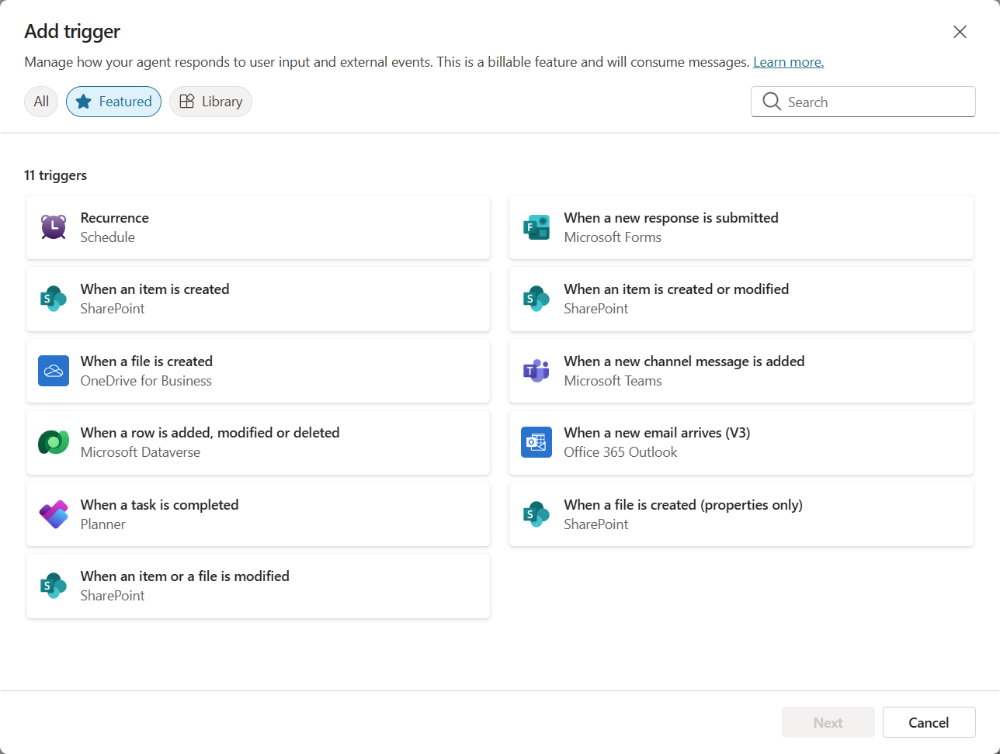

### Why Event Triggers matter in autonomous agents

Event triggers transform your agent from a reactive assistant into a proactive, autonomous helper:

1. **Autonomous operation** - your agent can work 24/7 without human intervention, responding to events as they happen.
    - *Example:* Automatically welcome new team members when they're added to a team.

2. **Real-time responsiveness** - instead of waiting for users to ask questions, your agent responds immediately to relevant events.
    - *Example*: Alert the IT team when a SharePoint document is modified.

3. **Workflow automation** - chain together multiple actions based on a single trigger event.
    - *Example:* When a new support ticket is created, create a task, notify the manager, and update the tracking dashboard.

4. **Consistent processes** - ensure important steps never get missed by automating responses to key events.
    - *Example:* Every new employee automatically gets onboarding materials and access requests.

5. **Data-driven actions** - use information from the triggering event to make smart decisions and take appropriate actions.
    - *Example:* Route urgent tickets to senior staff based on priority level in the trigger payload.

## ⚙️ How do Event Triggers work?

Event triggers operate through a three-step workflow that enables your agent to respond autonomously to external events:

### The trigger workflow

1. **Event Detection** - A specific event occurs in a connected system (SharePoint, Teams, Outlook, etc.)
2. **Trigger Activation** - The event trigger detects this event and sends a payload to your agent via a Power Automate Cloud Flow.
3. **Agent Response** - Your agent receives the payload and executes the instructions you've defined

### Event vs Topic triggers

Understanding the difference between these two trigger types is crucial:

| **Event Triggers** | **Topic Triggers** |
|-------------------|-------------------|
| Activated by external system events | Activated by user input/phrases |
| Enable autonomous agent behavior | Enable conversational responses |
| Use maker's authentication | Option for user's authentication |
| Run without user interaction | Require user to start conversation |
| Examples: File created, email received | Example: "What's the weather?" |

## 📦 Understanding trigger payloads

When an event occurs, the trigger sends a **payload** to your agent containing information about the event and instructions on how to respond.

### Default vs custom payloads

Every trigger type comes with a default payload structure, but you can customize it:

**Default payload** - Uses the standard format like `Use content from {Body}`

- Contains basic event information
- Uses generic processing instructions
- Good for simple scenarios

**Custom payload** - Add specific instructions and data formatting

- Include detailed directions for your agent
- Specify exactly what data to use and how
- Better for complex workflows

### Agent instructions vs custom payload instructions

You have two places to guide your agent's behavior with event triggers:

**Agent Instructions** (Global)

- Broad guidance that applies to all triggers
- Example: "When processing tickets, always check for duplicates first"
- Best for general behavior patterns

**Payload Instructions** (Trigger-specific)

- Specific directions for individual trigger types  
- Example: "For this SharePoint update, send a summary to the project channel"
- Best for complex agents with multiple triggers

💡 **Pro tip**: Avoid conflicting instructions between these two levels, as this can cause unexpected behavior.

## 🎯 Common Event Trigger scenarios

Here are practical examples of how event triggers can enhance your agent:

**IT Help Desk Agent**

- **Trigger**: New SharePoint list item (support ticket)
- **Action**: Automatically categorize, assign priority, and notify appropriate team members

**Employee Onboarding Agent**  

- **Trigger**: New user added to Dataverse
- **Action**: Send welcome message, create onboarding tasks, and provision access

**Project Management Agent**

- **Trigger**: Task completed in Planner
- **Action**: Update project dashboard, notify stakeholders, and check for blockers

**Document Management Agent**

- **Trigger**: File uploaded to specific SharePoint folder
- **Action**: Extract metadata, apply tags, and notify document owners

**Meeting Assistant Agent**

- **Trigger**: Calendar event created
- **Action**: Send pre-meeting reminders and agenda, book resources

## ⚠️ Publishing and authentication considerations

Before your agent can use event triggers in production, you need to understand authentication and security implications.

### Maker authentication

Event triggers use the **agent creator's credentials** for all authentication:

- Your agent accesses systems using your permissions
- Users can potentially access data through your credentials
- All actions are performed "as you" even when users interact with the agent

### Data protection best practices

To maintain security when publishing agents with event triggers:

1. **Evaluate data access** - Review what systems and data your triggers can access
2. **Test thoroughly** - Understand what information triggers include in payloads
3. **Narrow trigger scope** - Use specific parameters to limit what events activate triggers
4. **Review payload data** - Ensure triggers don't expose sensitive information
5. **Monitor usage** - Track trigger activity and resource consumption

## ⚠️ Troubleshooting and limitations

Keep these important considerations in mind when working with event triggers:

**Quota and billing impacts**

- Each trigger activation counts toward your message consumption
- Frequent triggers (like every-minute recurrence) can quickly consume quota
- Monitor usage to avoid throttling

**Technical requirements**

- Only available for agents with generative orchestration enabled
- Requires solution-aware cloud flow sharing to be enabled in your environment

**Data Loss Prevention (DLP)**

- Your organization's DLP policies determine which triggers are available
- Administrators can block event triggers entirely
- Contact your admin if expected triggers aren't available

## 🧪 Lab 10 - Add Event Triggers for autonomous agent behavior

### 🎯 Use case

You'll enhance your IT Help Desk agent to automatically respond to new support requests. When someone creates a new item in your SharePoint support tickets list, your agent will:

1. Trigger autonomously when the SharePoint ticket is created
2. Provide the ticket details and instructions on the steps that you want it to perform
3. Automatically acknowledge the ticket to the submitter via an AI generated email

This lab demonstrates how event triggers enable truly autonomous agent behavior.

### Prerequisites

Before starting this lab, ensure you have:

- ✅ Completed previous labs (especially Lab 6-8 for the IT Help Desk agent)
- ✅ Access to the SharePoint site with the IT support tickets list
- ✅ Copilot Studio environment with event triggers enabled
- ✅ Your agent has generative orchestration enabled
- ✅ Appropriate permissions in SharePoint and your Copilot Studio environment

### 10.1 Enable Generative AI and create a SharePoint item creation trigger

1. Open your **IT Help Desk agent** in **Copilot Studio**

2. First, ensure **Generative AI** is enabled for your agent:
   - Navigate to the **Overview** tab
   - Under the Orchestration section, Toggle **Generative orchestration** to **On** if it's not already enabled  
     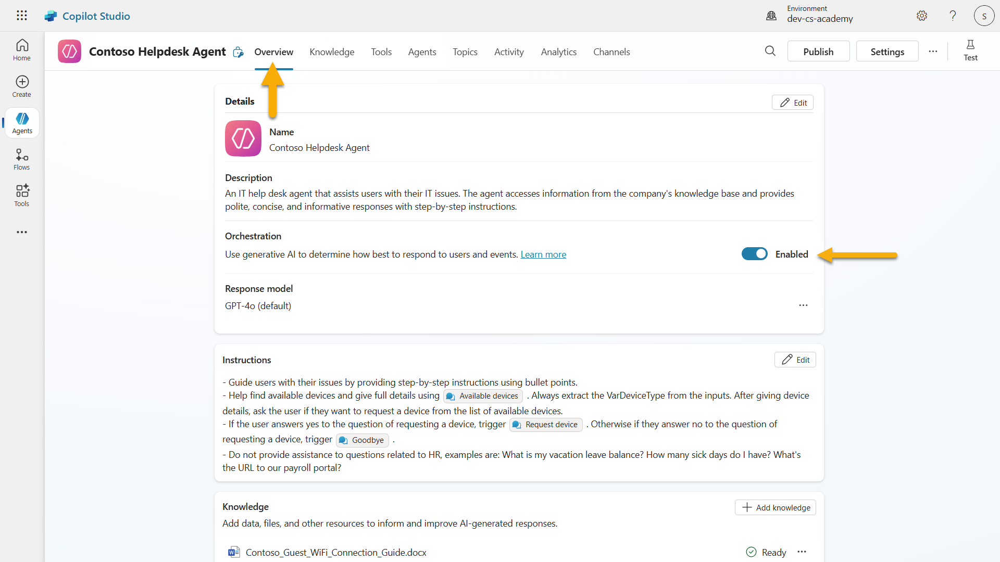

3. Navigate to the **Overview** tab and locate the **Triggers** section

4. Click **+ Add trigger** to open the trigger library  
    

5. Search for and select **When an item is created** (SharePoint)  
    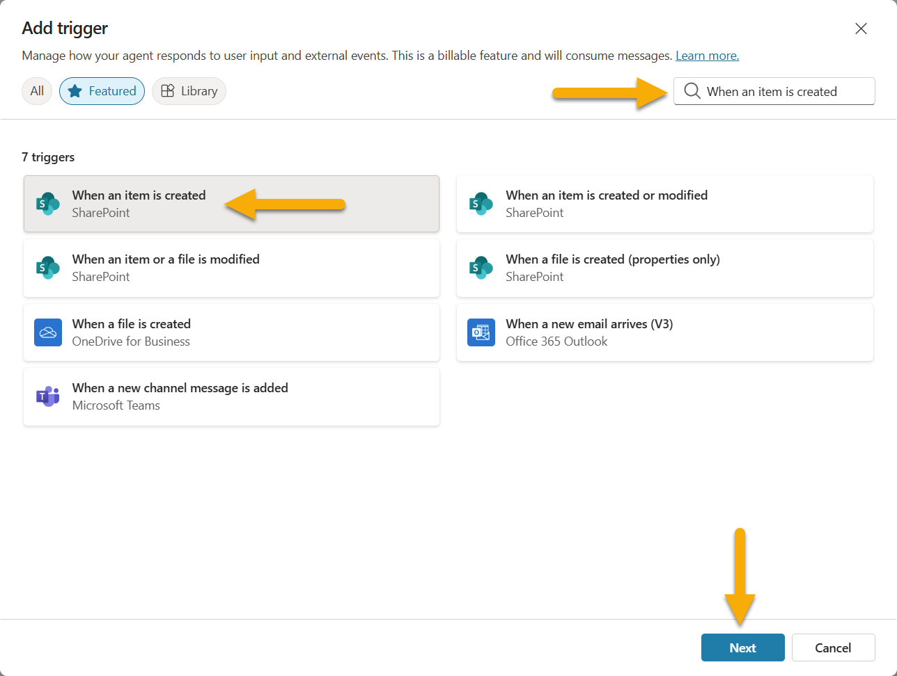

6. Configure the trigger name and connections:

   - **Trigger name:** New Support Ticket Created in SharePoint

7. Wait for the connections to configure, and select **Next** to proceed.  
   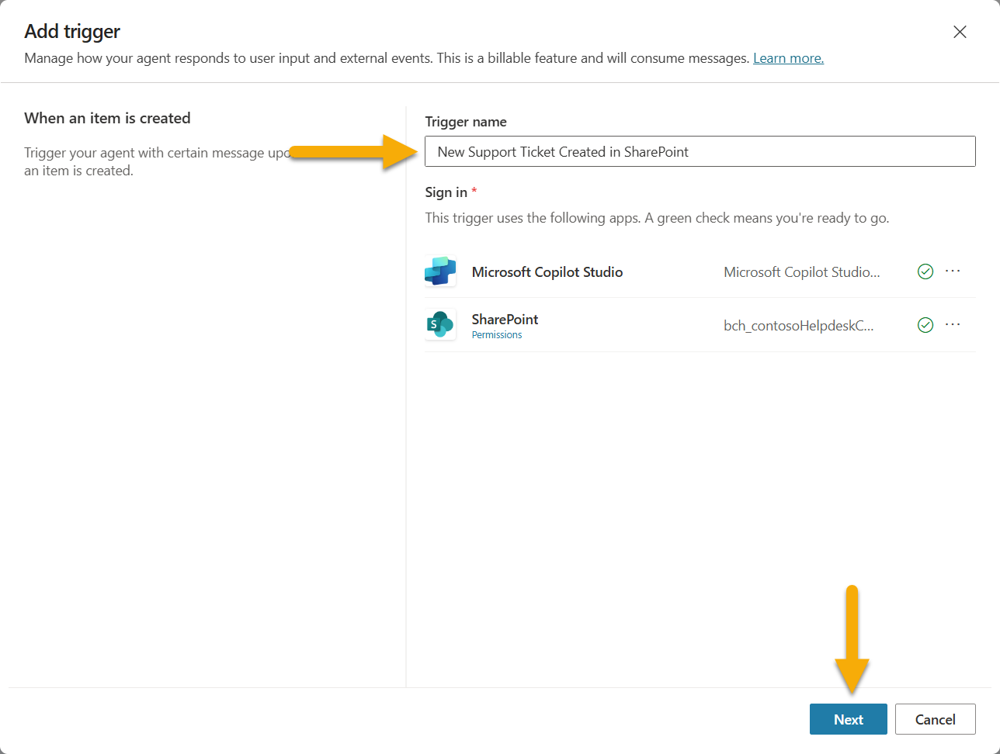

8. Configure the trigger parameters:

   - **Site Address**: Select your "Contoso IT" SharePoint site

   - **List Name**: Choose your "Tickets" list

   - **Additional instructions to the agent when it's invoked by the trigger:**

     ```text
     New Support Ticket Created in SharePoint: {Body}
     
     Use the 'Acknowledge SharePoint Ticket' tool to generate the email body automatically and respond.
     
     IMPORTANT: Do not wait for any user input. Work completely autonomously.
     ```

     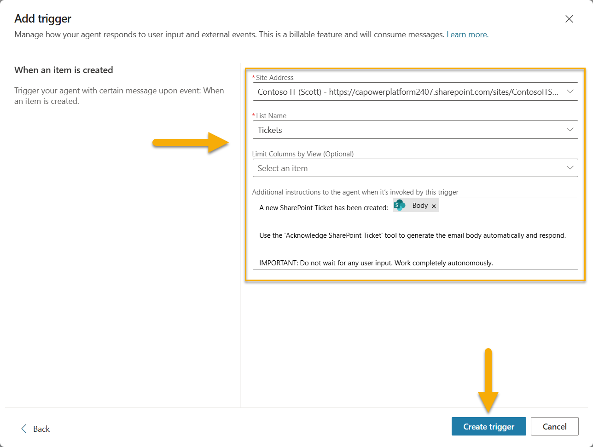

9. Select **Create trigger** to complete the trigger creation. A Power Automate Cloud Flow is automatically created to trigger the agent autonomously.

10. Select **Close**.

### 10.2 Edit the Trigger

1. Inside the **Triggers** section of the **Overview** tab, Select the **...** menu on the **New Support Ticket Created in SharePoint** trigger

1. Select **Edit in Power Automate**  
   

1. Select the **Sends a prompt to the specified copilot for processing** node

1. In the **Body/message** field, remove the Body content, **press the forward slash key** (/) and select **Insert Expression**  
   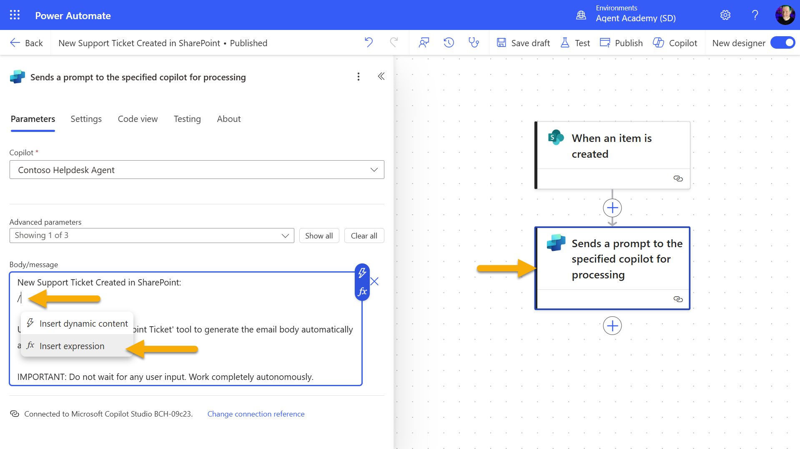

1. Enter the following expression to provide the agent with specific details about the ticket:

   ```text
   concat('Submitted By Name: ', first(triggerOutputs()?['body/value'])?['Author/DisplayName'], '\nSubmitted By Email: ', first(triggerOutputs()?['body/value'])?['Author/Email'], '\nTitle: ', first(triggerOutputs()?['body/value'])?['Title'], '\nIssue Description: ', first(triggerOutputs()?['body/value'])?['Description'], '\nPriority: ', first(triggerOutputs()?['body/value'])?['Priority/Value'],'\nTicket ID : ', first(triggerOutputs()?['body/value'])?['ID'])
   ```

1. Select **Add**  
   

1. Select **Publish** on the top right toolbar.

### 10.3 Create a tool for email acknowledgment

1. **Return** to your Agent in Copilot Studio

2. Navigate to the **Tools** tab in your agent

3. Click **+ Add a tool** and select **Connector**

4. Search for and select **Send an email (V2)** connector  
    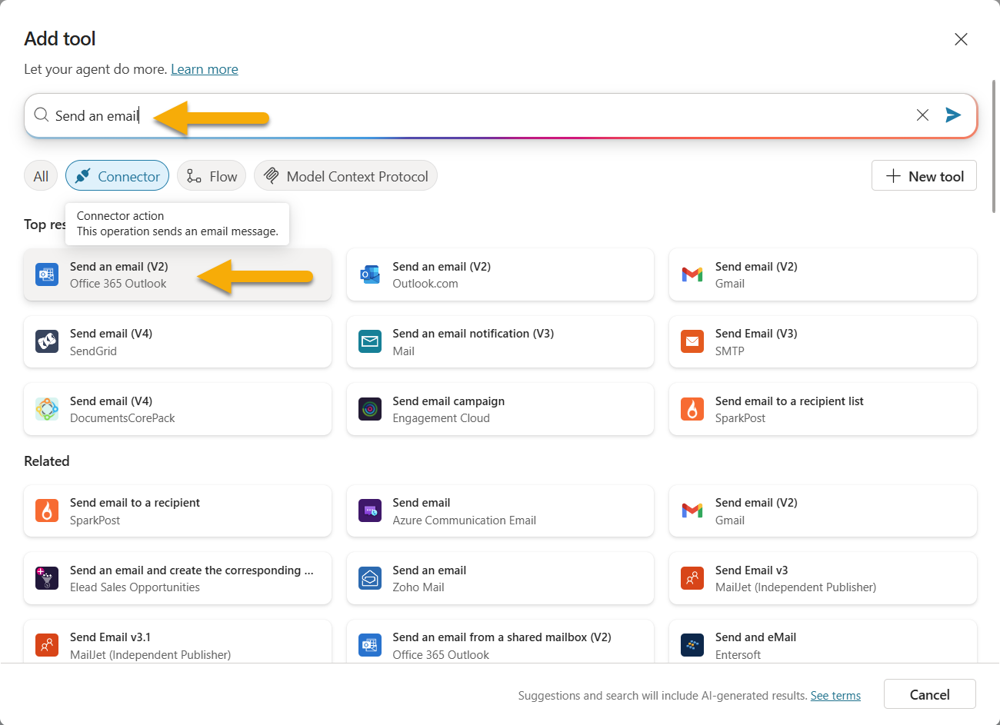

5. Wait for the connection to configure, and then select **Add and configure**

6. Configure the tool settings:

   - **Name**: Acknowledge SharePoint ticket
   - **Description**: This tool sends an email acknowledgement that a ticket has been received.

7. Select **Customize** next to the input parameters and configure as follows:

   **To**:

   - **Description**: The email address of the person submitting the SharePoint Ticket
   - **Identify as**: Email

   **Body**:
   - **Description**: An acknowledgement that the Ticket was received, and we aim to respond within 3 working days.

   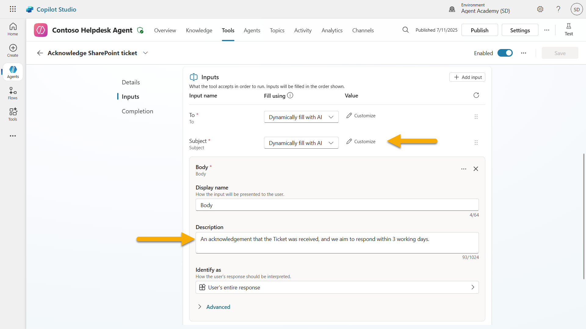

8. Select **Save**

### 10.4 Test the trigger

1. Inside your **Helpdesk Agent**, select the **Overview** tab
2. Click **Test Trigger** icon next to the **New Support Ticket Created in SharePoint** trigger. This will load the **Test your trigger** window.
3. Open a new browser tab and navigate to your **SharePoint IT Support Tickets list**
4. Click **+ Add new item** to create a test ticket:
   - **Title**: "Unable to connect to VPN"
   - **Description**: "Unable to connect to corporate WIFI network after recent update"
   - **Priority**: "Normal"

5. **Save** the SharePoint item  
    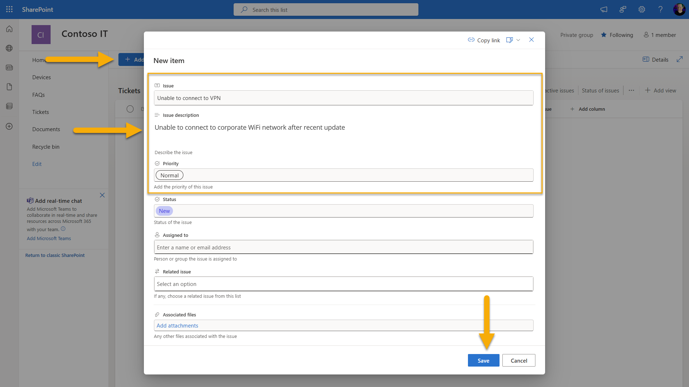
6. Return to **Copilot Studio** and monitor the **Test your trigger** panel for the trigger activation. Use the **Refresh** icon to load the trigger event, this may take a few minutes.  
    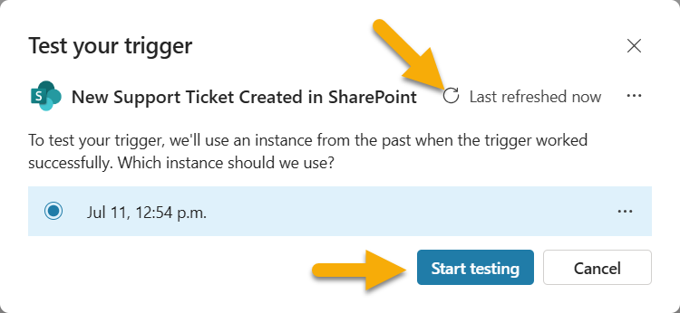
7. Once the trigger appears, select **Start testing**
8. Select the **Activity Map icon** at the top of the **Test your agent** panel
9. Verify that your agent:
   - Received the trigger payload
   - Called the "Acknowledge SharePoint ticket" tool  
     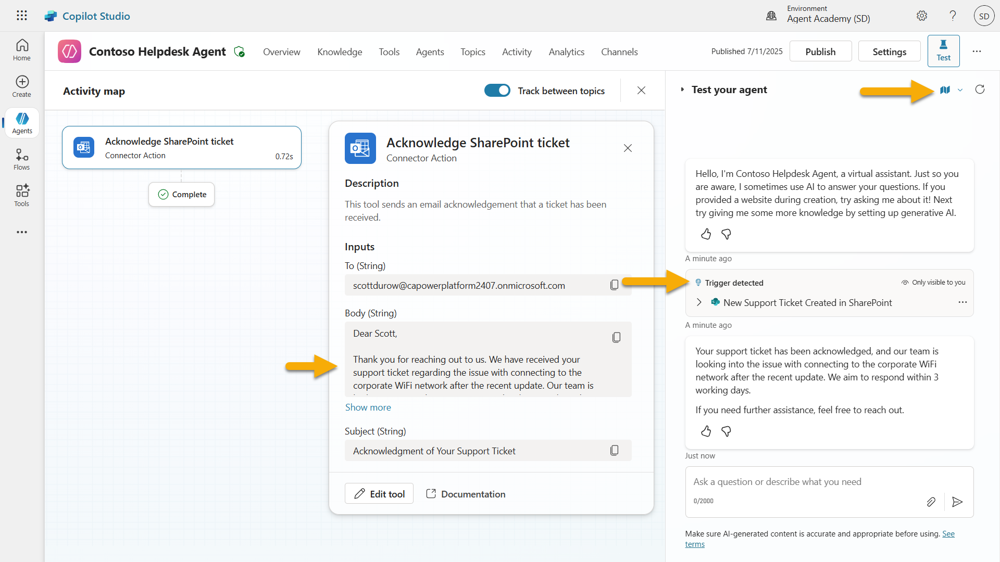
10. Check the email inbox of the submitter to confirm the acknowledgment email was sent  
    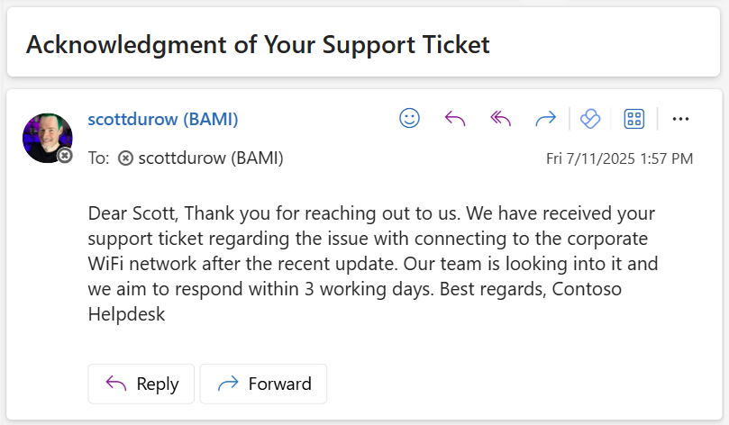
11. Review the **Activity** tab in Copilot Studio to see the complete trigger and tool execution

## ✅ Mission Complete

🎉 **Congratulations!** You've successfully implemented event triggers with connector tools that enable your agent to operate autonomously, automatically sending email acknowledgments and processing support tickets without user intervention. Once your agent is published, it will act autonomously on your behalf.

🚀 **Next up**: In our next lesson, you'll learn how to [publish your agent](../11-publish-your-agent/README.md) to Microsoft Teams and Microsoft 365 Copilot, making it available to your entire organization!

⏭️ [Move to **Publish your agent** lesson](../11-publish-your-agent/README.md)

## 📚 Tactical Resources

Ready to dive deeper into event triggers and autonomous agents? Check out these resources:

- **Microsoft Learn**: [Make your agent autonomous in Copilot Studio](https://learn.microsoft.com/en-us/training/modules/autonomous-agents-online-workshop/?WT.mc_id=power-177340-scottdurow)
- **Documentation**: [Add an event trigger](https://learn.microsoft.com/en-us/microsoft-copilot-studio/authoring-trigger-event?WT.mc_id=power-177340-scottdurow)
- **Best Practices**: [Power Automate triggers introduction](https://learn.microsoft.com/en-us/power-automate/triggers-introduction?WT.mc_id=power-177340-scottdurow)
- **Advanced Scenarios**: [Using Power Automate flows with agents](https://learn.microsoft.com/en-us/microsoft-copilot-studio/advanced-flow-create?WT.mc_id=power-177340-scottdurow)
- **Security**: [Data loss prevention for Copilot Studio](https://learn.microsoft.com/en-us/microsoft-copilot-studio/admin-data-loss-prevention?WT.mc_id=power-177340-scottdurow)
