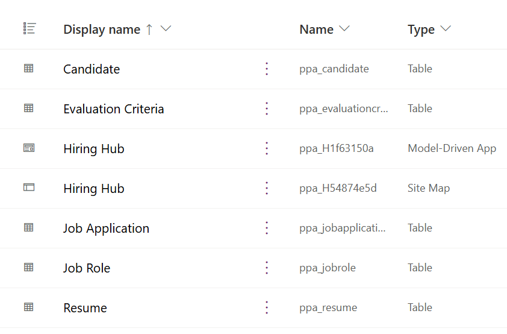
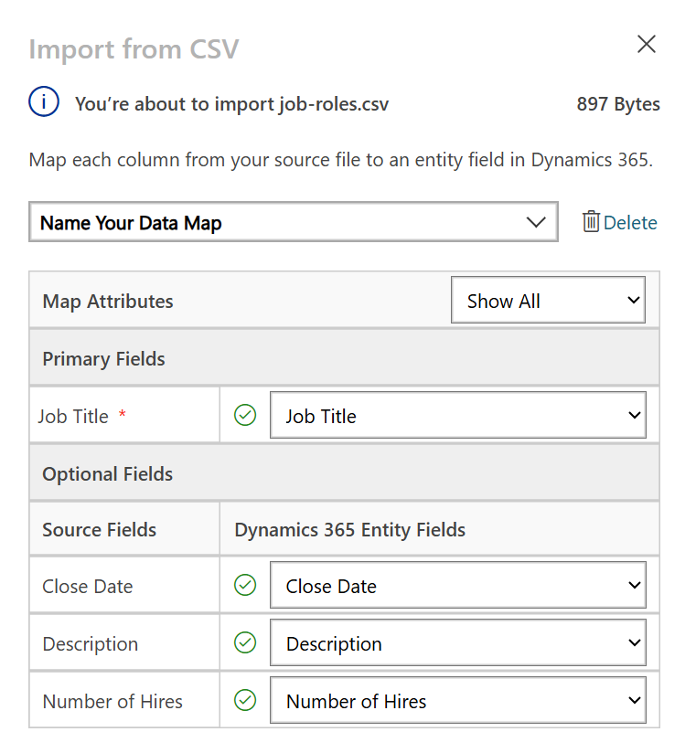
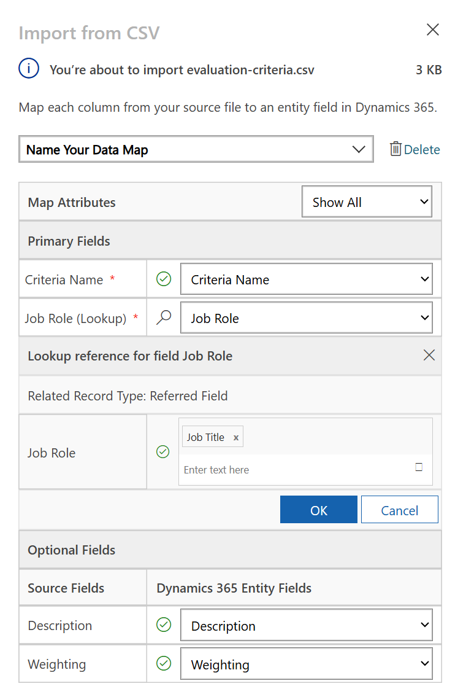
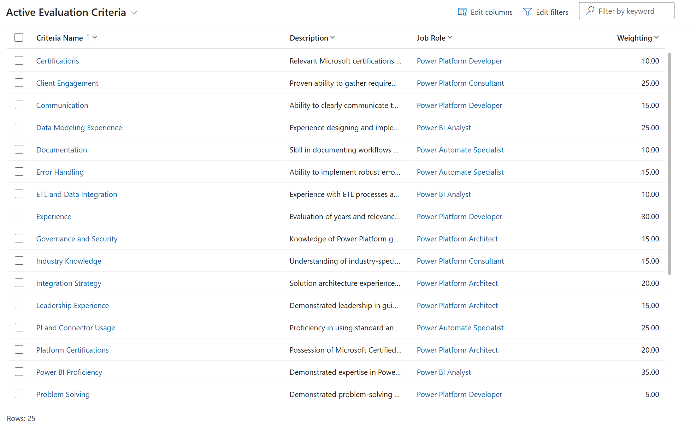

# 🚨 Mission 01: Get started with the Hiring Agent

--8<-- "disclaimer.md"

## 🕵️‍♂️ CODENAME: OPERATION TALENT SCOUT

> **⏱️ Operation Time Window:** `~45 minutes`

## 🎯 Mission Brief

In this mission, you'll get started with AI-powered recruitment by importing a pre-built solution that contains the foundational data structure for a hiring management system. You'll then create a basic Hiring Agent that serves as the starting point for the comprehensive hiring automation scenario you'll build throughout the Agent Academy Operative program. This initial agent will establish the foundation that you'll enhance with advanced capabilities in subsequent missions.

## 🔎 Objectives

By completing this mission, you will:

- **Scenario Understanding**: Gain comprehensive knowledge of hiring automation challenges and solutions
- **Solution Deployment**: Successfully import and configure the fundamentals of a hiring management system
- **Agent Creation**: Build a hiring agent that is the start of the scenario you're going to build as an Agent Academy Operative

## 🔍 Prerequisites

Before embarking on this mission, ensure you have:

- Copilot Studio license
- Access to a Microsoft Power Platform environment
- Administrative permissions to create solutions and agents

## 🏢 Understanding the Hiring Automation Scenario

This scenario demonstrates how a company can use Microsoft Copilot Studio to improve and automate its hiring process. It introduces a system of agents that work together to handle tasks like reviewing resumes, recommending job roles, preparing interview materials, and evaluating candidates.

### Business Value

The solution helps HR teams save time and make better decisions by:

- Automatically processing resumes received via email.
- Suggesting suitable job roles based on candidate profiles.
- Creating job applications and interview guides tailored to each candidate.
- Ensuring fair and compliant hiring practices through built-in safety and moderation features.
- Collecting feedback to improve the solution.

### How It Works

- A central **Hiring Agent** coordinates the process and stores data in Microsoft Dataverse.
- An **Application Intake Agent** reads resumes and creates job applications.
- An **Interview Prep Agent** generates interview questions and documents based on the candidate's background.
- The system can be published to a demo website, allowing stakeholders to interact with it.

This scenario is ideal for organizations looking to modernize their recruitment workflows using AI-powered automation, while maintaining transparency, fairness, and efficiency.

## 🧪 Lab: Setup the Hiring Agent

In this hands-on lab, you'll establish the foundation for your hiring automation system. You'll begin by importing a pre-configured solution that contains all the necessary Dataverse tables and data structure for managing candidates, job positions, and hiring workflows. Next, you'll populate these tables with sample data that will support your learning throughout this module and provide realistic scenarios for testing. Finally, you'll create the Hiring Agent in Copilot Studio, setting up the basic conversational interface that will serve as the cornerstone for all the other features you'll add in future missions.

### 🧪 Lab 1.1: Import solution

1. Go to **[Copilot Studio](https://copilotstudio.microsoft.com)**
1. Select the **...** in the left navigation and select **Solutions**
1. Select the **Import Solution** button on the top
1. **[Download](https://raw.githubusercontent.com/microsoft/agent-academy/refs/heads/main/docs/operative-preview/01-get-started/assets/Operative_1_0_0_0.zip)** the prepared solution
1. Select **Browse** and select the downloaded solution from the previous step
1. Select **Next**
1. Select **Import**

!!! success
    On success, you will see a green notification bar with the following message when it's done:  
    "Solution "Operative" imported successfully."

When the solution is imported, take a look at what you imported by selecting the display name of the solution (`Operative`).



The following components are imported:

| Display Name | Type | Description |
|-------------|------|-------------|
| Candidate | Table | Candidate information |
| Evaluation Criteria | Table | Evaluation criteria for the role |
| Hiring Hub | Model-Driven App | Application for managing the hiring process |
| Hiring Hub | Site Map | Navigation structure for the Hiring Hub app |
| Job Application | Table | Job applications |
| Job Role | Table | Job roles |
| Resume | Table | Resumes of the candidates |

As the last task for this lab, Select the **Publish all customizations** button at the top of the page.

### 🧪 Lab 1.2: Import sample data

In this lab, you will add sample data to some of the tables that you imported in lab 1.1.

#### Download the files to import

1. **[Download](https://raw.githubusercontent.com/microsoft/agent-academy/refs/heads/main/docs/operative-preview/01-get-started/assets/evaluation-criteria.csv)** the CSV-file with the evaluation criteria
1. **[Download](https://raw.githubusercontent.com/microsoft/agent-academy/refs/heads/main/docs/operative-preview/01-get-started/assets/job-roles.csv)** the CSV-file with the job roles

#### Import the Job Role sample data

1. Go back to the solution you just imported in the last lab
1. Select the **Hiring Hub** Model-Driven App by selecting the checkmark in front of the row
1. Select the **Play** button at the top

    !!! warning
        You might be prompted to login again. Make sure to do that. After doing that, you should see the Hiring Hub app.

1. Select **Job Roles** in the left navigation
1. Select the **More** icon (three dots below each other) in the command bar
1. Select the **right arrow** next to *Import from Excel*

    

1. Select **Import from CSV**

    

1. Select the **Choose File** button, select the **job-roles.csv** file you just downloaded and then select **Open**
1. Select **Next**
1. Leave the next step as is and select **Review Mapping**

    

1. Make sure the mapping is correct and select **Finish Import**

    !!! info
        This will start an import and you will be able to track progress or finish the process immediately by selecting **Done**

1. Select **Done**

This can take a little while, but you can hit the **Refresh** button to see if the import has succeeded.


#### Import the Evaluation Criteria sample data

1. Select **Evaluation Criteria** in the left navigation
1. Select the **More** icon (three dots below each other) in the command bar
1. Select the **right arrow** next to *Import from Excel*

    

1. Select **Import from CSV**

    

1. Select the **Choose File** button, select the **evaluation-criteria.csv** file you just downloaded and then select **Open**
1. Select **Next**
1. Leave the next step as is and select **Review Mapping**

    

1. Now we have to do a bit more work for the mapping. Select the magnifying glass(🔎 icon) next to the Job Role field
1. Make sure **Job Title** is selected here, and if not - add it
1. Select **OK**
1. Make sure the rest of the mapping is correct too and select **Finish Import**

    !!! info
        This will start an import again and you will be able to track progress or finish the process immediately by selecting **Done**

1. Select **Done**

This can take a little while, but you can hit the **Refresh** button to see if the import has succeeded.



### 🧪 Lab 1.3: Create the hiring agent

Now you are done with the setup of the prerequisites, it's time for the actual work! Let's add our Hiring Agent first!

1. Go to **[Copilot Studio](https://copilotstudio.microsoft.com)** and make sure you are in the same environment as where you imported the solution and the data
1. Select **Agents** in the left navigation
1. Select **New Agent**
1. Select **Configure**
1. For **Name**, enter:

    ```text
    Hiring Agent
    ```

1. For **Description**, enter:

    ```text
    Central orchestrator for all hiring activities
    ```

1. Select the **...** next to the *Create* button on the top right corner
1. Select **Update advanced settings**
1. As **Solution**, select `Operative`
1. Select **Update**
1. Select **Create** in the top right corner

This will create the Hiring Agent for you, which you will use throughout this Operative course.

## 🎉 Mission Complete

Mission 01 is completed! You now have mastered the following skills:

✅ **Scenario Understanding**: Comprehensive knowledge of hiring automation challenges and solutions  
✅ **Solution Deployment**: Successfully imported and configured the fundamentals of a hiring management system  
✅ **Agent Creation**: Built an hiring agent that is the start of the scenario you're going to build as an Agent Academy Operative  

Next up is [Mission 02](../02-multi-agent/README.md): Make your agent multi-agent ready with connected agents.

## 📚 Tactical Resources

- [Microsoft Copilot Studio - Create an agent](https://learn.microsoft.com/microsoft-copilot-studio/authoring-first-bot)
- [Microsoft Dataverse Documentation](https://learn.microsoft.com/power-apps/maker/data-platform)
