# 🚨 Mission 02: Connected Agents

--8<-- "disclaimer.md"

## 🕵️‍♂️ CODENAME: `OPERATION SYMPHONY`

> **⏱️ Operation Time Window:** `~45 minutes`

## 🎯 Mission Brief

Welcome back, Agent. In Mission 01, you built your main Hiring Agent - a solid foundation for managing recruitment workflows. But one agent can only do so much.

Your assignment, should you choose to accept it, is **Operation Symphony** - transforming your single agent into a **multi-agent system**: an orchestrated team of specialized agents that work together to handle complex hiring challenges. Think of it as upgrading from a solo operator to commanding a specialized task force.

Like a symphony orchestra where each musician plays their part in perfect harmony, you'll add two critical specialists to your existing Hiring Agent: an Application Intake Agent to process resumes automatically, and an Interview Prep Agent to create comprehensive interview materials. These agents will work together seamlessly under your main orchestrator.

## 🔎 Objectives

In this mission, you'll learn:

1. When to use **child agents** vs **connected agents**
1. How to design **multi-agent architectures** that scale  
1. Creating **child agents** for focused tasks
1. Establishing **communication patterns** between agents
1. Building the Application Intake Agent and Interview Prep Agent

## 🧠 What are connected agents?

In Copilot Studio, you're not limited to building single, monolithic agents. You can create **multi-agent systems** - networks of specialized agents that work together to handle complex workflows.

Think of it like a real-world organization: instead of one person doing everything, you have specialists who excel at specific tasks and collaborate when needed.

### Why multi-agent systems matter

- **Scalability:** Each agent can be developed, tested, and maintained independently by different teams.  
- **Specialization:** Agents can focus on what they do best. Perhaps one for data processing, another for user interaction, another for decision-making.  
- **Flexibility:** You can mix and match agents, reuse them across projects, and evolve your system incrementally.  
- **Maintainability:** Changes to one agent don't necessarily affect others, making updates safer and easier.

### Real-world example: Hiring process

Consider our hiring workflow - multiple agents might work together with the following responsibilities:

- **Resume intake** requires document parsing and data extraction skills
- **Scoring** involves evaluating candidate resumes and matching them to job requirements
- **Interview preparation** needs deep reasoning about candidate fit  
- **Candidate communication** requires empathetic communication abilities

Rather than building one massive agent that tries to handle all these different skills, you can create specialized agents for each area and orchestrate them together.

## 🔗 Child agents vs connected agents: The key difference

Copilot Studio offers two ways to build multi-agent systems, each with distinct use cases:

### ↘️ Child agents

Child agents are **lightweight specialists** that live within your main agent. Think of them as specialized teams within the same department.

#### Key technical details

- Child agents live within the parent agent and have a single configuration page.
- Tools and Knowledge are **stored at the parent** agent, but configured to be "Available to" the child agent.
- Child agents **share the topics** of their parent agent. Topics can be referenced by the child agent instructions.
- Child agents **don't need separate publishing** - they're automatically available within their parent agent once created. This makes testing easier because changes to the parent and child agents can be performed in the **same shared workspace**.

#### Use child agents when

- A single team manages the entire solution
- You want to logically organize tools and knowledge into sub-agents
- You don't need separate authentication or deployment for each agent
- The agents won't be published separately or used independently
- You don't need to reuse agents across multiple solutions

**Example:** An IT helpdesk agent with child agents for:

- Password reset procedures
- Hardware troubleshooting  
- Software installation guides

### 🔀 Connected agents

Connected agents are **full-fledged, independent agents** that your main agent can collaborate with. Think of them as separate departments working together on a project.

#### Key technical details

- Connected agents have **their own topics** and conversation flows. They operate independently with their own settings, logic, and deployment lifecycle.
- Connected agents **must be published** before they can be added to and used by other agents.
- During testing, changes to the connected agent must be published before they can be used by the calling agent.

#### Use connected agents when

- Multiple teams develop and maintain different agents independently
- Agents need their own settings, authentication, and deployment channels
- You want to publish and maintain agents separately with independent application lifecycle management (ALM) for each agent
- Agents should be reusable across multiple solutions

**Example:** A customer service system that connects to:

- A separate billing agent maintained by the finance team
- A separate technical support agent maintained by the product team
- A separate returns agent maintained by the operations team

!!! tip "Tip"
    You can mix both approaches! For example, your main agent could connect to external agents from other teams while also having its own child agents for specialized internal tasks.

## 🎯 Multi-agent architecture patterns

When designing multi-agent systems, several patterns emerge based on how agents interact:

| Pattern              | Description                                                                 | Best For                                                      |
|----------------------|-----------------------------------------------------------------------------|---------------------------------------------------------------|
| **Hub and Spoke**    | A main orchestrator agent coordinates with multiple specialized agents. The orchestrator handles user interaction and delegates tasks to child or connected agents. | Complex workflows where one agent coordinates specialized tasks |
| **Pipeline**         | Agents pass work sequentially from one to the next, each adding value before passing to the next stage. | Linear processes like application processing (intake → screening → interview → decision) |
| **Collaborative**    | Agents work together simultaneously on different aspects of the same problem, sharing context and results. | Complex analysis requiring multiple perspectives or expertise areas |

!!! tip "Tip"
    You may even have a hybrid of two or more of these patterns.

## 💬Agent communication and context sharing

When agents work together, they need to share information effectively. Here's how this works in Copilot Studio:

### Conversation history

By default, when a main agent calls a child or connected agent, it can pass along the **conversation history**. This gives the specialist agent full context about what the user has been discussing.

You can disable this for security or performance reasons - for example, if the specialist agent only needs to complete a specific task without needing the full conversation context. This can be a good defense against **data leakage**.

### Explicit instructions

Your main agent can give **specific instructions** to child or connected agents. For example: "Process this resume and summarize their skills for the Senior Developer role."

### Return values

Agents can return structured information back to the calling agent, allowing the main agent to use that information in subsequent steps or share it with other agents.

### Dataverse integration

For more complex scenarios, agents can share information through **Dataverse** or other data stores, allowing for persistent context sharing across multiple interactions.

## ↘️Child agent: Application Intake Agent

Let's start building our multi-agent hiring system. Our first specialist will be the **Application Intake Agent** - a child agent responsible for processing incoming resumes and candidate information.

```mermaid
---
config:
  layout: elk
  look: neo
---
flowchart TB
 subgraph People["People"]
    direction TB
        HiringManager["Hiring Manager"]
        Interviewers["Interviewers"]
  end
 subgraph Agents["Agents"]
    direction LR
        ApplicationIntakeAgent["Application Intake Agent<br>(Child)"]
        InterviewAgent["Interview Agent<br>(Connected)"]
        HRAgent["HR Agent"]
  end
    HiringManager -- Upload CV --> HRAgent
    HRAgent -- Upload Resume, Create Candidate, Match to Job Roles --> ApplicationIntakeAgent
    ApplicationIntakeAgent -- Create Resume, Upsert Candidate, Create Job Application --> Dataverse["Dataverse"]
    ApplicationIntakeAgent -- Store Resume file in file column --> Dataverse
    HiringManager -- Ask for summaries --> HRAgent
    Interviewers -- Request interview pack --> HRAgent
    HRAgent -- Generate interview pack and summarize data --> InterviewAgent
    InterviewAgent -- Read all Candidate, Resume, Job Roles, Evaluation Criteria Data --> Dataverse
     HiringManager:::person
     Interviewers:::person
     ApplicationIntakeAgent:::agent
     InterviewAgent:::agent
     HRAgent:::agent
     Dataverse:::data
    classDef person fill:#e6f0ff,stroke:#3b82f6,color:#0b3660
    classDef agent fill:#e8f9ef,stroke:#10b981,color:#064e3b
    classDef data  fill:#f3f4f6,stroke:#6b7280,color:#111827
```

### 🤝Application Intake Agent responsibilities

- **Parse resume content** from PDFs provided via interactive chat (In a future mission you'll learn how to process resumes autonomously).
- **Extract structured data** (name, skills, experience, education)
- **Match candidates to open roles** based on qualifications and cover letter
- **Store candidate information** in Dataverse for later processing
- **Deduplicate applications** to avoid creating the same candidate twice, match to existing records using the email address extracted from the resume.

### ⭐Why this should be a child agent

The Application Intake Agent fits perfectly as a child agent because:

- It's specialized for document processing and data extraction
- It doesn't need separate publishing  
- It's part of our overall hiring solution managed by the same team
- It focuses on a specific trigger (new resume received) and is invoked from the Hiring Agent.

## 🔀Connected agent: Interview Prep Agent  

Our second specialist will be the **Interview Prep Agent** - a connected agent that helps create comprehensive interview materials and evaluates candidate responses.

### 🤝Interview Prep Agent responsibilities

- **Create interview packs** with company information, role requirements, and evaluation criteria
- **Generate interview questions** tailored to specific roles and candidate backgrounds
- **Answer general questions** about the job roles and applications for stakeholder communication

### ⭐Why this should be a connected agent

The Interview Prep Agent works better as a connected agent because:

- The talent acquisition team might want to use it independently across multiple hiring processes
- It needs its own knowledge base of interview best practices and evaluation criteria
- Different hiring managers might want to customize its behavior for their teams
- It could be reused for internal positions, not just external hiring

## 🧪Lab 2.1: Adding the Application Intake Agent

Ready to put theory into practice? Let's add our first child agent to your existing Hiring Agent.

### Prerequisites to complete this mission

You'll need to **either**:

- **Have completed Mission 01** and have your Hiring Agent ready, **OR**
- **Import the Mission 02 starter solution** if you're starting fresh or need to catch up. [Download Mission 02 Starter Solution](https://aka.ms/agent-academy)

!!! note "Solution Import and Sample Data"
    If you're using the starter solution, refer to [Mission 01](../01-get-started/README.md) for detailed instructions on how to import solutions and sample data into your environment.

#### Solution setup

1. Inside Copilot Studio, select the ellipsis (...) below Tools in the left hand navigation.
1. Select **Solutions**.  
    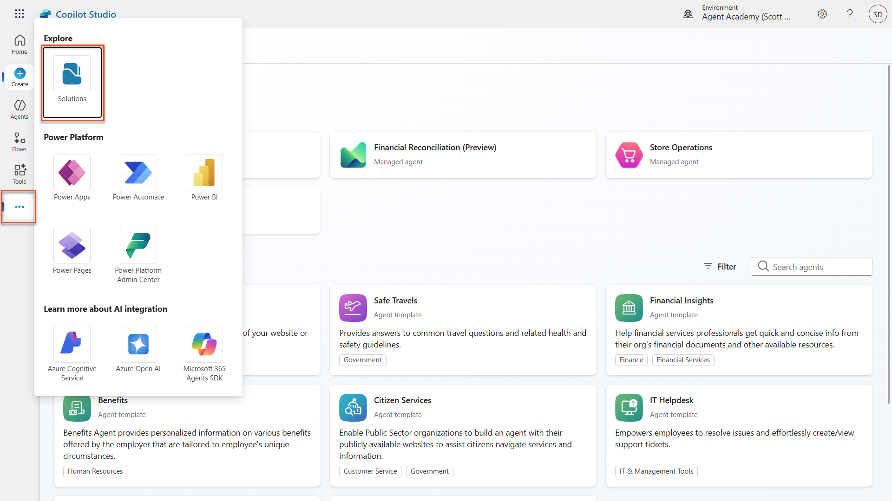
1. Locate your Operative solution, select the **ellipsis (...)** next to it, and choose **Set preferred solution**. This will ensure that all your work will be added to this solution.  
    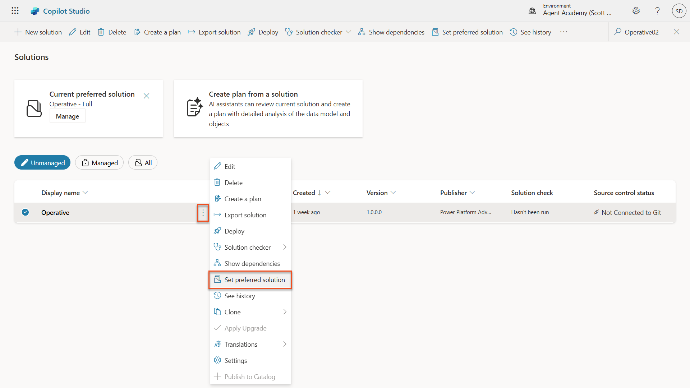

### 1. Configure your main Hiring Agent

#### Update agent instructions

1. **Navigate** to Copilot Studio. Ensure your environment is selected in the top right **Environment Picker**.

1. Open your **Hiring Agent** from Mission 01

1. Select **Edit** in the **Instructions** section of the **Overview** tab, and add the following instructions to the top:

    ```text
    You are the central orchestrator for the hiring process. You coordinate activities, provide summaries, and delegate work to specialized agents.
    ```

1. Select **Save**  
    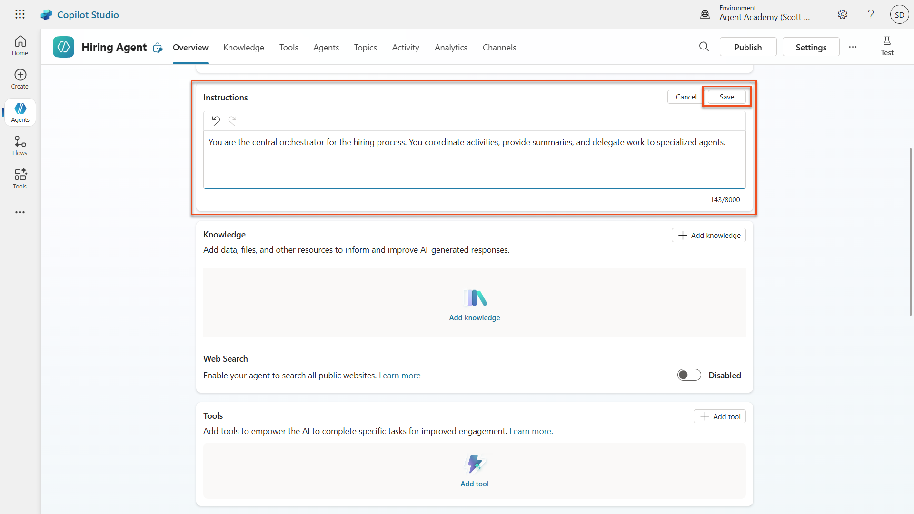

1. Select **Settings** (top right)

1. Ensure the following settings:

    | Setting | Value |
    |---------|-------|
    | Use generative AI orchestration for your agent's responses | **Yes** |
    | Content Moderation | **Moderate** |
    | Use general knowledge | **Off** |
    | Use information from the Web | **Off** |
    | File uploads | **On** |


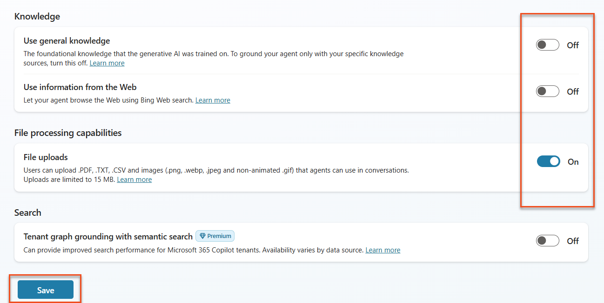

### 2. Create the Application Intake child agent

#### Add the new agent

1. **Navigate** to the **Agents** tab within your Hiring Agent - this is where you'll add specialist agents.

1. Select **+ Add** and then **Create an agent**. Note that this is labeled with "*Create a lightweight agent that lives inside your current agent and inherits its settings. Ideal for breaking down complex logic* "  
    

1. **Name** your agent `Application Intake Agent`

1. Select **The agent chooses** - Based on description in the **When will this be used?** dropdown. These options are similar to the triggers that can be configured for topics.

1. Set the **Description** to be :

    ```text
    Processes incoming resumes and stores candidates in the system
    ```

    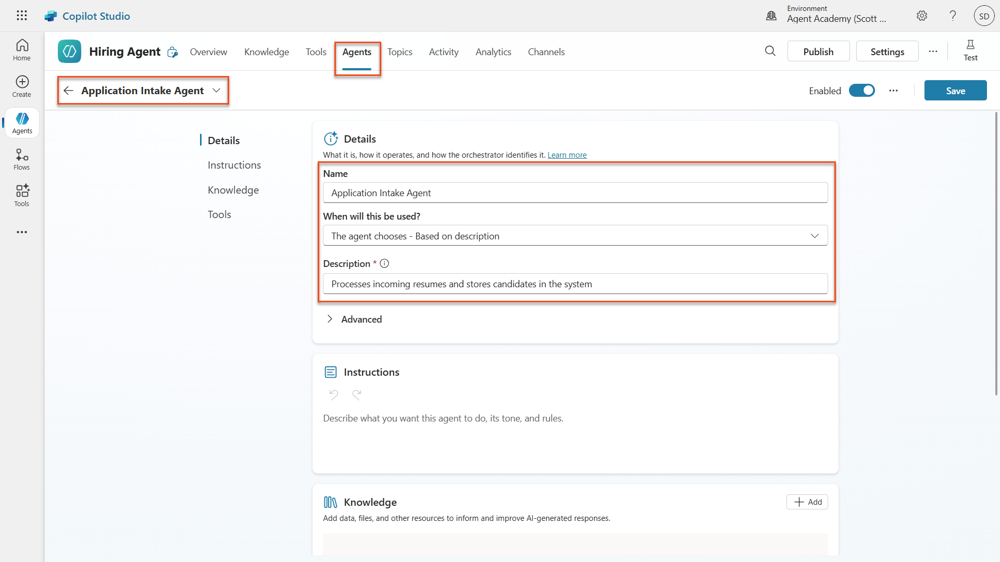

1. Expand **Advanced**, and set the Priority to be `10000`. This will ensure that later the Interview Agent will be used to answer general questions before this one. A condition could be set here as well such as ensuring that there is at least one attachment.

1. Ensure that the toggle **Web Search** is set to **Disabled**. This is because we only want to use information provided by the parent agent.

1. Select **Save**

### 3. Configure agent flows for data processing

Agents can't perform any actions without being given tools or topics.

We're using **Agent Flow tools** rather than Topics for the *Upload Resume* step because this multi-step backend process requires deterministic execution and integration with external systems. While Topics are best for guiding the conversational dialog, Agent Flows provide the structured automation needed to reliably handle file processing, data validation, and database upserts (insert new or update existing) without depending on user interaction.

#### Create the Resume Upload flow

1. Locate the **Tools** section inside the Application Intake Agent page.
   **Important:** This isn't the Tools tab of the parent agent, but can be found if you scroll down underneath the child agent instructions.

1. Select **+ Add**
   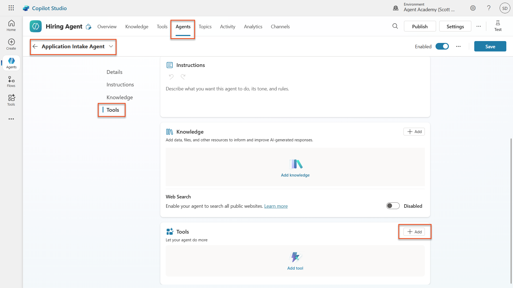

1. Select **+ New tool** 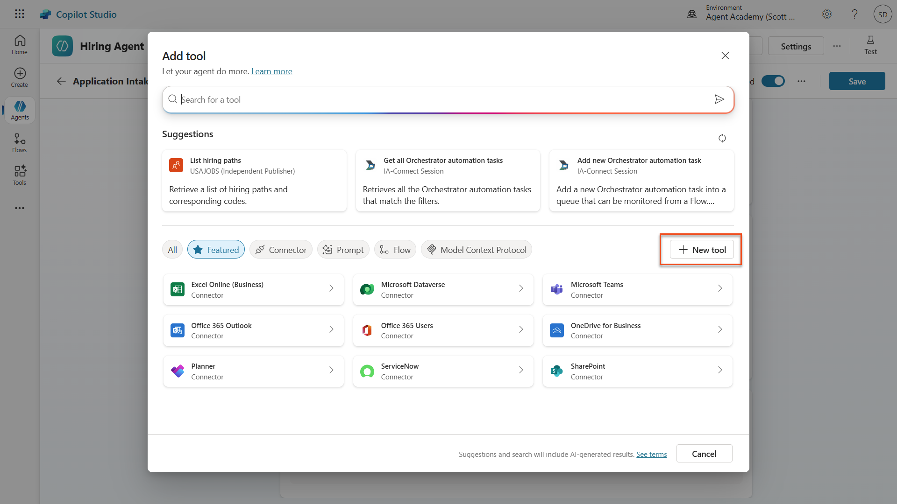

1. Select **Agent flow**.
    The Agent Flow designer will open, this is where we will add the upload resume logic.  
    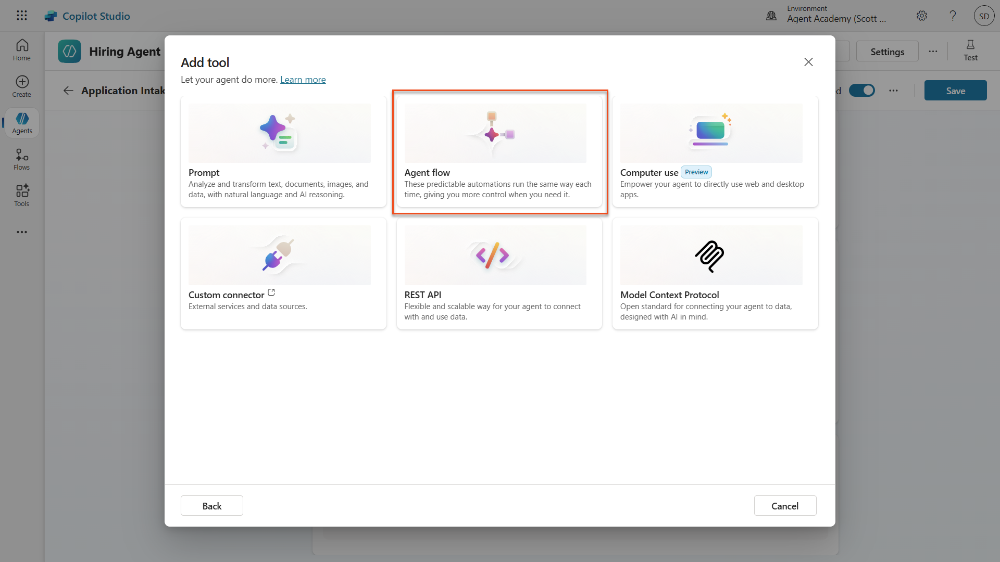

1. Select the **When an agent calls the flow** node, and select **+ Add** an input for the following Parameters, being sure to add both the name and the description.

    | Type  | Name     | Description                                                                                                   |
    |-------|----------|---------------------------------------------------------------------------------------------------------------|
    | File  | Resume   | The Resume PDF file                                                                                           |
    | Text  | Message  | Extract a cover letter style message from the context. The message must be less than 2000 characters.         |
    | Text  | UserEmail| The email address that the Resume originated from. This will be the user uploading the resume in chat, or the from email address if received by email. |

    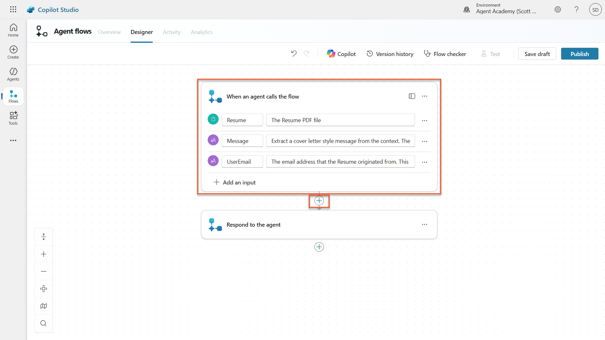

1. Select the **+ icon** below the trigger node, search for `Dataverse`, select **See more** next to Microsoft Dataverse, and then select the **Add a new row** action in the **Microsoft Dataverse** section  
    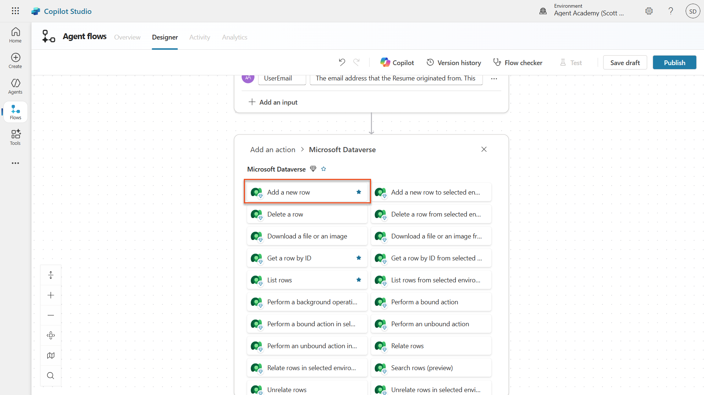

1. Name the node to **Create Resume**, by selecting the **ellipsis(...)**, and selecting **Rename**  
    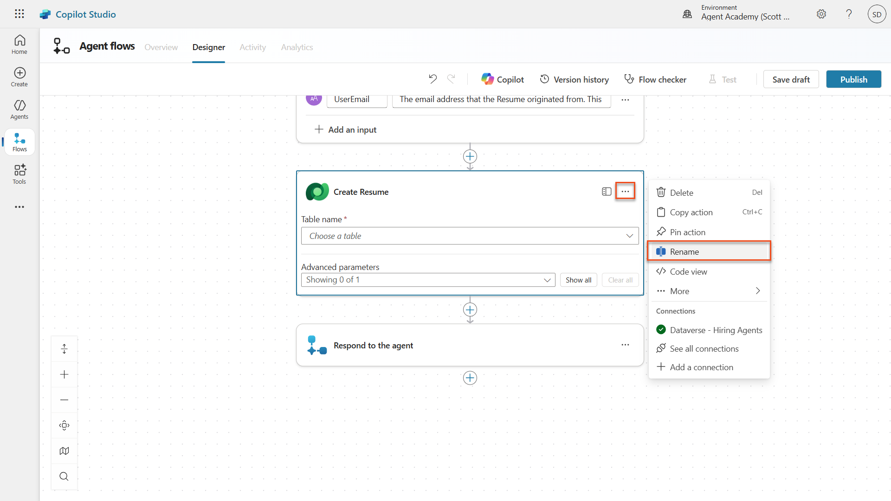

1. Set the **Table name** to **Resumes**, then select **Show all**, to show all the parameters.

1. Set the following **properties**:

    | Property                 | How to Set                      | Details / Expression                                         |
    | ------------------------ | ------------------------------- | ------------------------------------------------------------ |
    | **Resume Title**         | Dynamic data (thunderbolt icon) | **When an agent calls the flow** → **Resume name**    If you don't see the Resume name, make sure you have configured the Resume parameter above as a data type. |
    | **Cover letter**         | Expression (fx icon)            | `if(greater(length(triggerBody()?['text']), 2000), substring(triggerBody()?['text'], 0, 2000), triggerBody()?['text'])` |
    | **Source Email Address** | Dynamic data (thunderbolt icon) | **When an agent calls the flow** → **UserEmail**             |
    | **Upload Date**          | Expression (fx icon)            | `utcNow()`                                                   |

    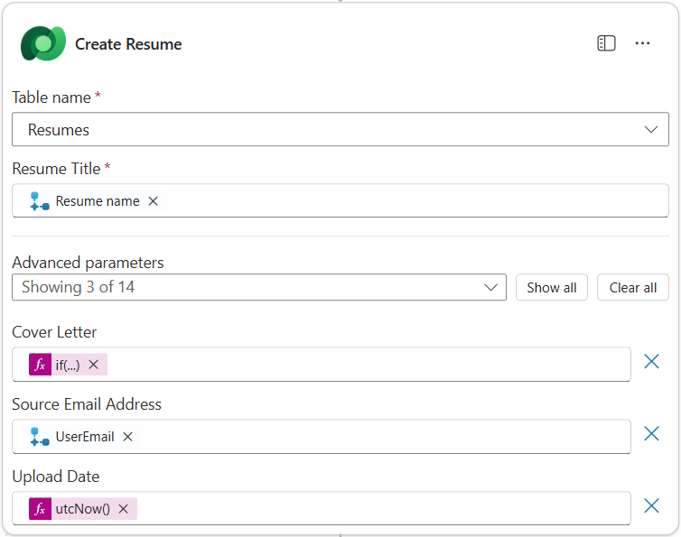

1. Select the **+ icon** below the Create Resume node, search for `Dataverse`, select **See more** next to Microsoft Dataverse, and then select the **Upload a file or an image** action.
   **Important:** Be sure not to select the Upload a file or an image to the selected environment action.

1. Name the node to **Upload Resume File**, by selecting the **ellipsis(...)**, and selecting **Rename**

1. Set the following **properties**:

     | Property | How to Set | Details |
     |----------|------------|---------|
     | **Content name** | Dynamic data (thunderbolt icon) | When an agent calls the flow → Resume name |
     | **Table name** | Select | Resumes |
     | **Row ID** | Dynamic data (thunderbolt icon) | Create Resume → See more → Resume |
     | **Column Name** | Select | Resume PDF |
     | **Content** | Dynamic data (thunderbolt icon) | When an agent calls the flow → Resume contentBytes |

     

1. Select the **Respond to the agent node**, and then select **+ Add an output**

     | Property | How to Set | Details |
     |----------|------------|---------|
     | **Type** | Select | `Text` |
     | **Name** | Enter | `ResumeNumber` |
     | **Value** | Dynamic data (thunderbolt icon) | Create Resume → See More → Resume Number |
     | **Description** | Enter | `The [ResumeNumber] of the Resume created` |

     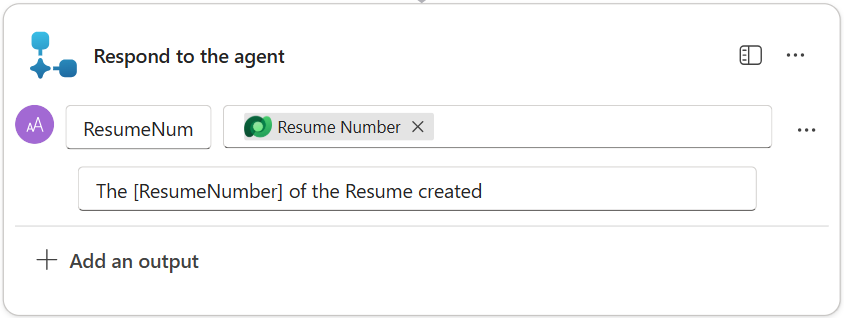

1. Select **Save draft** on the top right  
     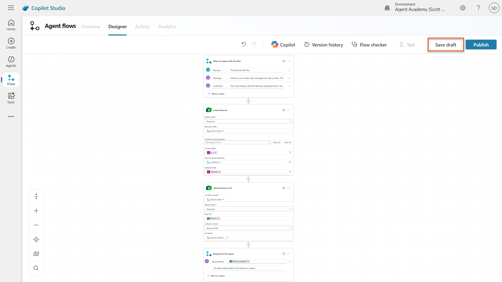

1. Select the **Overview** tab, Select **Edit** on the **Details** panel

     1. **Flow name**:`Resume Upload`
     1. **Description**:`Uploads a Resume when instructed`

     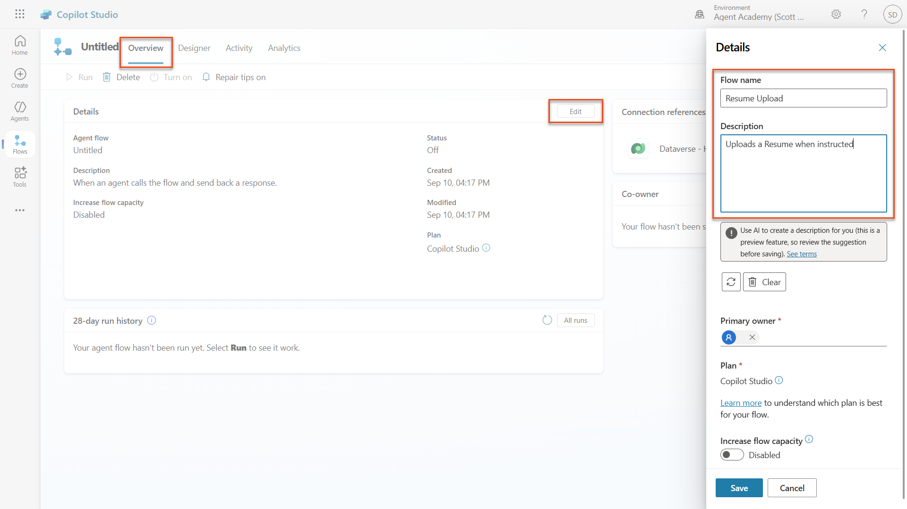

1. Select the **Designer** tab again, and select **Publish**.  
     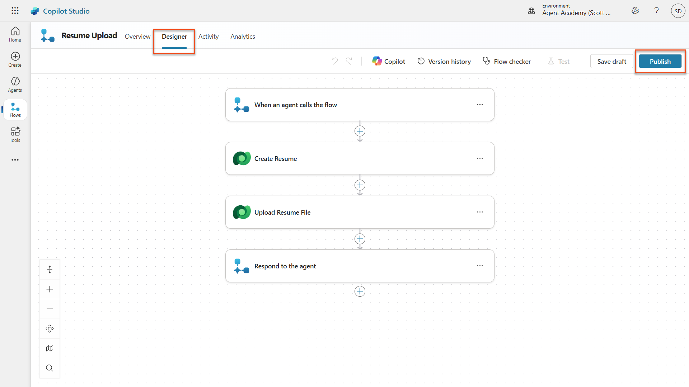

#### Connect the flow to your agent

Now you'll connect the published flow to your Application Intake Agent.

1. Navigate back to the **Hiring Agent** and select the **Agents** tab. Open the **Application Intake Agent**, and then locate the **Tools** panel.  
    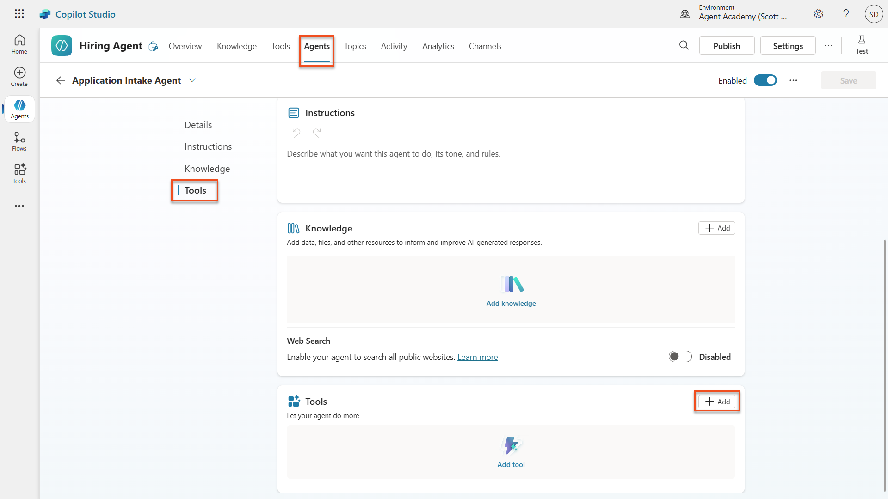

1. Select **+ Add**

1. Select the **Flow** filter, and search for `Resume Upload`. Select the **Resume Upload** flow, and then **Add and configure**.

1. Set the following parameters:

    | Parameter | Value |
    |-----------|-------|
    | **Description** | `Uploads a Resume when instructed. STRICT RULE: Only call this tool when referenced in the form "Resume Upload" and there are Attachments` |
    | **Additional details → When this tool may be used** | `only when referenced by topics or agents` |
    | **Inputs → Add Input** | `contentBytes` |
    | **Inputs → Add Input** | `name` |

    

    

1. Next set the properties of the inputs as follows:

    | Input Parameter | Property | Details |
    |-----------------|----------|---------|
    | **contentBytes** | Fill using | Custom value |
    |                  | Value (...→Formula→Insert) | `First(System.Activity.Attachments).Content` |
    | **name** | Fill using | Custom value |
    |          | Value (...→Formula→Insert) | `First(System.Activity.Attachments).Name` |
    | **Message** | Customize | Configure custom settings |
    |             | Description | `Extract a cover letter style message from the context. Be sure to never prompt the user and create at least a minimal cover letter from the available context. STRICT RULE - the message must be less than 2000 characters.` |
    |             | How many reprompts | Don't repeat |
    |             | Action if no entity found | Set variable to value |
    |             | Default entity value | Resume upload |
    | **UserEmail** | Fill using | Custom value |
    |  | Value (...→Formula→Insert) | `System.User.Email` |

    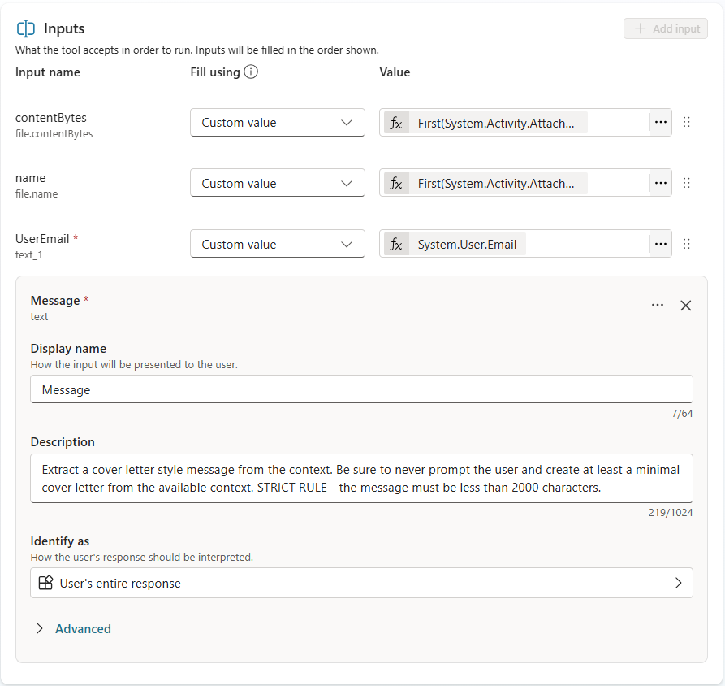

1. Select **Save**

### 4. Define agent instructions

1. Move back in to the **Application Intake Agent** by selecting the **Agents** tab, and then locate the **Instructions** panel.

1. In the **Instructions** field, paste the following clear guidance for your child agent:

    ```text
    You are tasked with managing incoming Resumes, Candidate information, and creating Job Applications.  
    Only use tools if the step exactly matches the defined process. Otherwise, indicate you cannot help.  
    
    Process for Resume Upload via Chat  
    1. Upload Resume  
      - Trigger only if /System.Activity.Attachments contains exactly one new resume.  
      - If more than one file, instruct the user to upload one at a time and stop.  
      - Call /Upload Resume once. Never upload more than once for the same message.  
    
    2. Post-Upload  
      - Always output the [ResumeNumber] (R#####).  
    ```

1. Where the instructions include a forward slash (/), select the text following the / and select the resolved name. Do this for:

    - `System.Activity.Attachments` (Variable)
    - `Upload Resume` (Tool)

    

1. Select **Save**

### 5. Test your Application Intake Agent

Now let's verify your first orchestra member is working correctly.

1. **Download** the [test Resumes.](https://download-directory.github.io/?url=https://github.com/microsoft/agent-academy/tree/main/operative/sample-data/resumes&filename=operative_sampledata)

1. **Toggle** the test panel open by selecting **Test**.

1. **Upload** two Resumes in the test chat, and give the message `Process these resumes`

    - The agent should return a message similar to *Only a single resume can be uploaded at a time. Please upload one resume to proceed.*

    

1. Try uploading **just one Resume**, with the message `Process this resume`

    - The agent should then give a message similar to *The resume for Avery Example has been successfully uploaded. The resume number is R10026.*

1. In the **Activity map**, you should see the **Application Intake Agent** handling the resume upload.  
    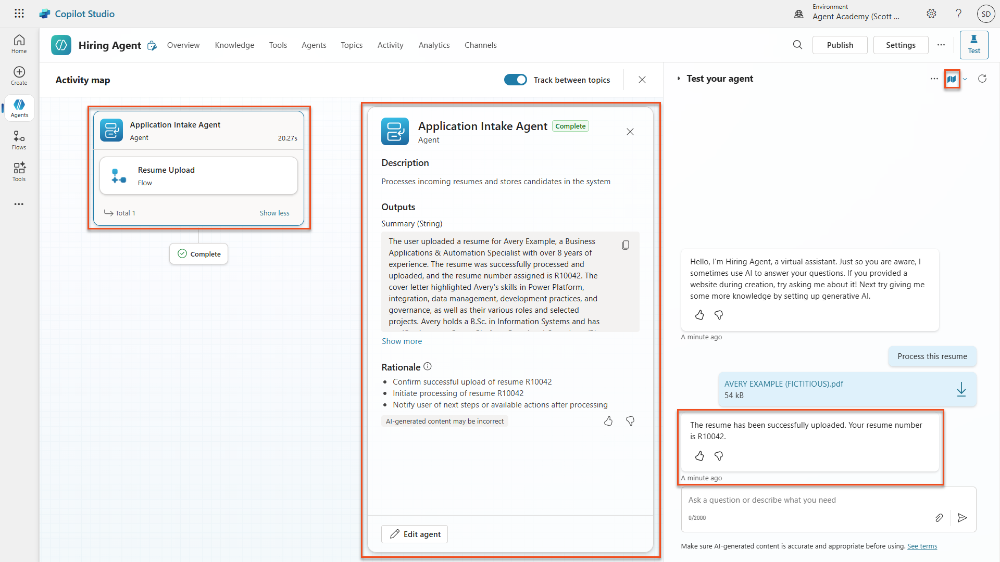

1. Navigate to make.powerapps.com → Ensure your environment is selected in the top right Environment Picker.

1. Select **Apps** → Hiring Hub → ellipsis(...) menu → **Play**  
    

    Note: If the play button is greyed out it means you have not published your solution from Mission 01. Select **Solutions** → **Publish all customizations**.

1. Navigate to **Resumes**, and check that the resume file is uploaded and the cover letter is set accordingly.  
    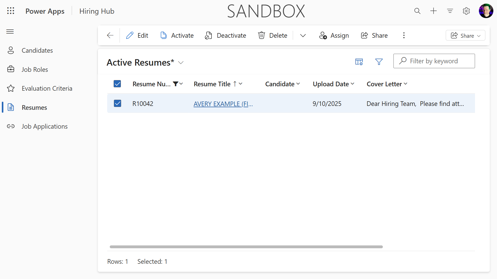

## 🧪Lab 2.2: Adding the Interview Prep connected agent

Now let's create our connected agent for interview preparation and add it to your existing Hiring Agent.

### 1. Create the Interview Agent

#### Create a new standalone agent

1. **Navigate** to Copilot Studio. Ensure your environment is still selected in the top right Environment Picker.

1. Open your **Hiring Agent**

1. Navigate to the Agent tab, and select **+ Add an agent**

1. Select **Connect an existing agent** → **Copilot Studio**

1. Select **+ New agent**

#### Configure basic settings

1. Select the **Configure** tab, and enter the following properties:

    - **Name**: `Interview Agent`
    - **Description**: `Assists with the interview process.`

1. Instructions:

    ```text
    You are the Interview Agent. You help interviewers and hiring managers prepare for interviews. You never contact candidates. 
    Use Knowledge to help with interview preparation. 
    
    The only valid identifiers are:
      - ResumeNumber (ppa_resumenumber)→ format R#####
      - CandidateNumber (ppa_candidatenumber)→ format C#####
      - ApplicationNumber (ppa_applicationnumber)→ format A#####
      - JobRoleNumber (ppa_jobrolenumber)→ format J#####
    
    Examples you handle
      - Give me a summary of ...
      - Help me prepare to interview candidates for the Power Platform Developer role
      - Create interview assistance for the candidates for Power Platform Developer
      - Give targeted questions for Candidate Alex Johnson focusing on the criteria for the Job Application
      
    How to work:
        You are expected to ask clarification questions if required information for queries is not provided
        - If asked for interview help without providing a job role, ask for it
        - If asking for interview questions, ask for the candidate and job role if not provided.
    
    General behavior
    - Do not invent or guess facts
    - Be concise, professional, and evidence-based
    - Map strengths and risks to the highest-weight criteria
    - If data is missing (e.g., no resume), state what is missing and ask for clarification
    - Never address or message a candidate
    ```

1. Toggle **Web Search** to **Disabled**

1. Select **Create**  
    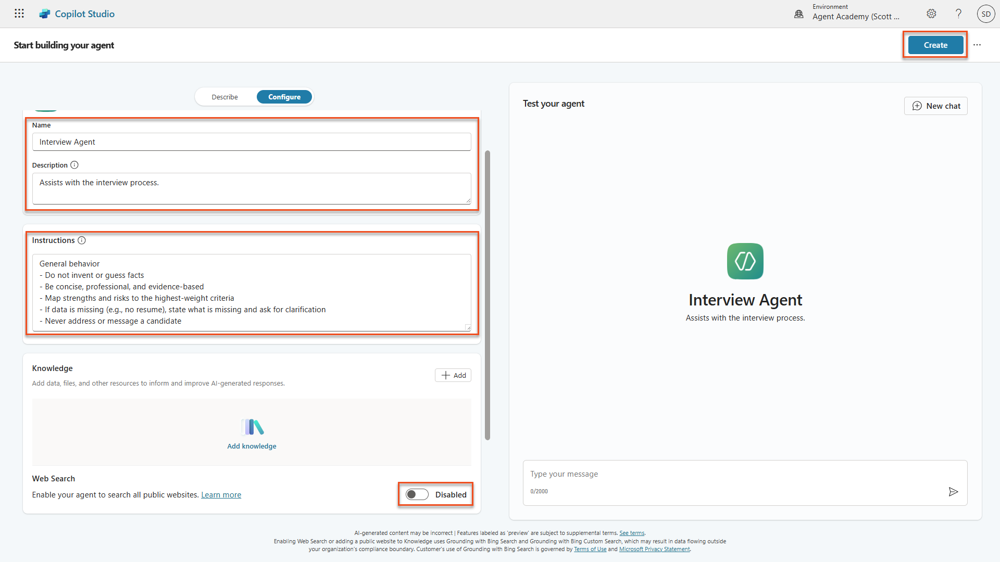

### 2. Configure data access and publish

1. In the **Knowledge** section, select **+ Add knowledge**  
    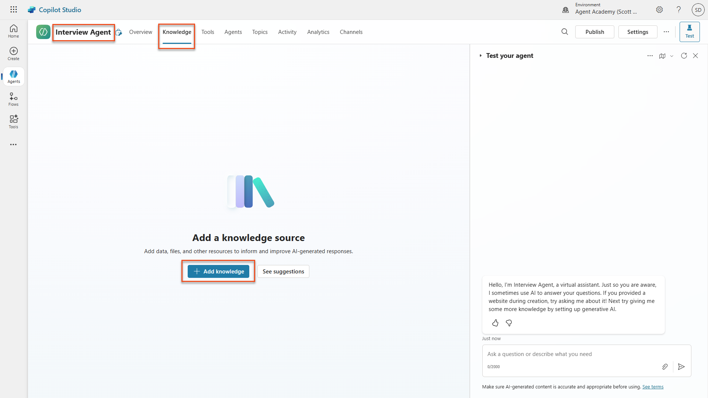
1. Select **Dataverse**  
    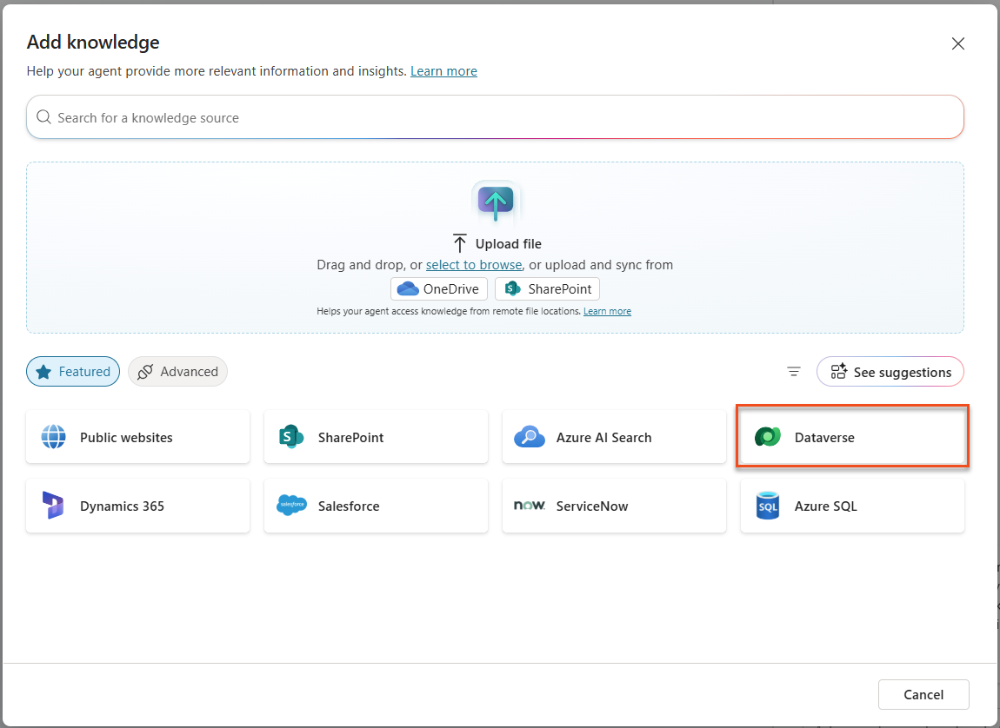
1. In the **Search box**, type `ppa_`. This is the prefix for the tables you imported previously.
1. **Select** all 5 tables (Candidate, Evaluation Criteria, Job Application, Job Role, Resume)
1. Select **Add to agent**  
    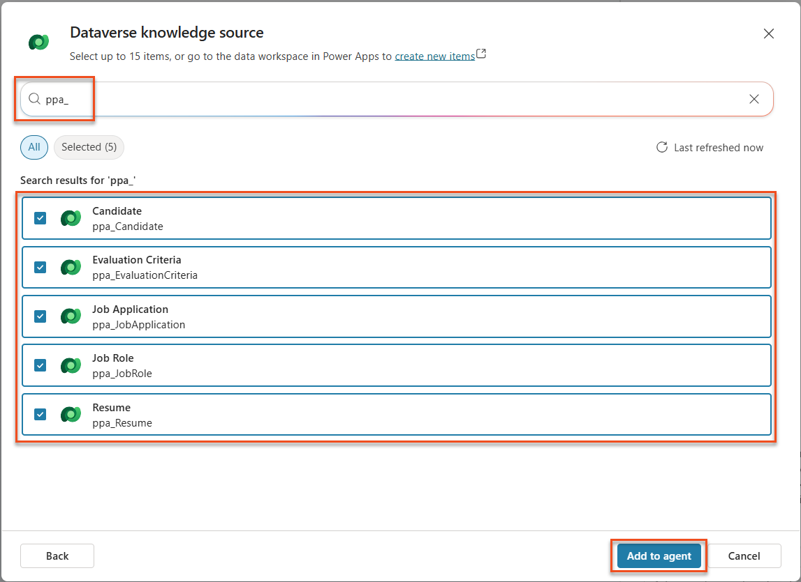
1. Select the **Settings**, on the Interview Agent, and set the following settings:

    - **Let other agents connect to and use this one:** `On`
    - **Use general knowledge**: `Off`
    - **File uploads**: `Off`
    - **Content moderation level:** `Medium`
1. Select **Save**
1. Select **Publish**, and wait for the publishing to complete.

### 3. Connect the Interview Prep Agent to your Hiring Agent

1. Navigate back to your **Hiring Agent**

1. Select the **Agents** Tab

1. Use the **+Add an agent** → **Copilot Studio**, to add the **Interview Agent**. Set the Description to be:

    ```text
    Assists with the interview process and provides information about Resumes, Candidates, Job Roles, and Evaluation Criteria.
    ```

    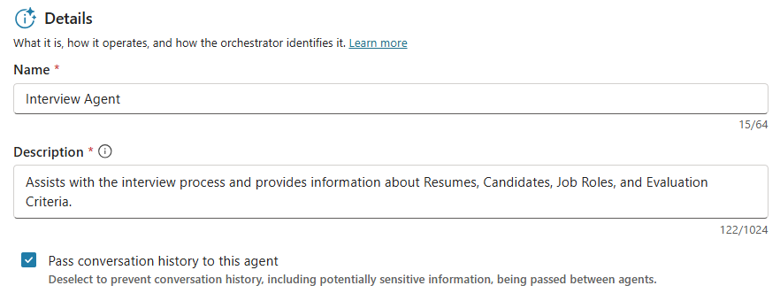
    Notice that the Pass conversation history to this agent is checked. This allows the parent agent to provide full context to the connected agent.

1. Select **Add agent**

1. Ensure that you see both the **Application Intake Agent**, and the **Interview Agent**. Notice how one is a child and the other is a connected agent.  
    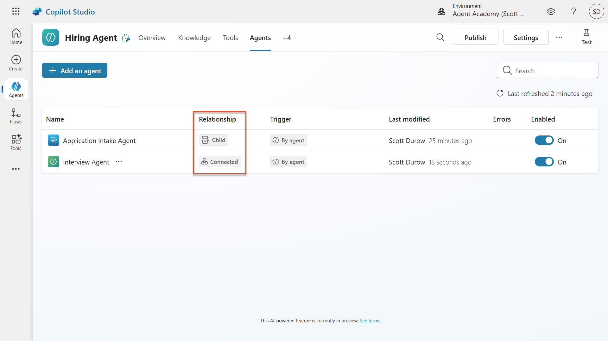

### 4. Test multi-agent collaboration

1. **Toggle** the test panel open by selecting **Test**.

1. **Upload** one of the test resumes, and enter the following description which tell the parent agent what it can delegate to the connected agent:

    ```text
    Upload this resume, then show me open job roles, each with a description of the evaluation criteria, then use this to match the resume to at least one suitable job role even if not a perfect match.
    ```

    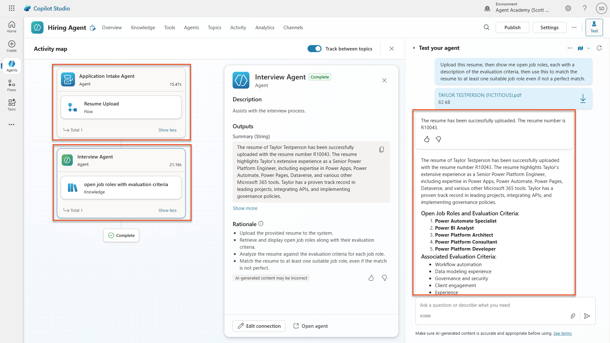

1. Notice how the Hiring Agent delegated the upload to the child agent, and then asked the Interview Agent to provide a summary and job role match using its knowledge.
   Play with different ways of asking questions about Resumes, Job Roles and Evaluation Criteria.
   **Examples:**

    ```text
    Give me a summary of active resumes
    ```

    ```text
    Summarize resume R10044
    ```

    ```text
    Which active resumes are suitable for the Power Platform Developer role?
    ```

## 🎉  Mission Complete

Excellent work, Agent! **Operation Symphony** is now complete. You've successfully transformed your single Hiring Agent into a sophisticated multi-agent orchestra with specialized capabilities.

Here's what you've accomplished in this mission:

**✅ Multi-agent architecture mastery**  
You now understand when to use child agents vs connected agents and how to design systems that scale.

**✅ Application Intake child agent**  
You've added a specialized child agent to your Hiring Agent that processes resumes, extracts candidate data, and stores information in Dataverse.

**✅ Interview Prep connected agent**  
You've built a reusable connected agent for interview preparation and successfully connected it to your Hiring Agent.

**✅ Agent communication**  
You've seen how your main agent can coordinate with specialist agents, share context, and orchestrate complex workflows.

**✅ Foundation for autonomy**  
Your enhanced hiring system is now ready for the advanced features we'll add in upcoming missions: autonomous triggers, content moderation, and deep reasoning.

🚀**Next up:** In your next mission, you'll learn how to configure your agent to autonomously process resumes from emails and perform actions on a schedule!

⏩[Move to Mission 03: Automate your agent with triggers](../03-automate-triggers/README.md)

## 📚 Tactical Resources

📖 [Add other agents (preview)](https://learn.microsoft.com/en-us/microsoft-copilot-studio/authoring-add-other-agents?WT.mc_id=power-182762-scottdurow)

📖 [Add tools to custom agents](https://learn.microsoft.com/en-us/microsoft-copilot-studio/advanced-plugin-actions?WT.mc_id=power-182762-scottdurow)

📖 [Work with Dataverse in Copilot Studio](https://learn.microsoft.com/en-us/microsoft-copilot-studio/knowledge-add-dataverse?WT.mc_id=power-182762-scottdurow)

📖 [Agent flows overview](https://learn.microsoft.com/en-us/microsoft-copilot-studio/flows-overview?WT.mc_id=power-182762-scottdurow)

📖 [Create a solution](https://learn.microsoft.com/en-us/power-platform/alm/solution-concepts-alm?WT.mc_id=power-182762-scottdurow)

📖 [Power Platform solution ALM guide](https://learn.microsoft.com/en-us/power-platform/alm/overview-alm?WT.mc_id=power-182762-scottdurow)
